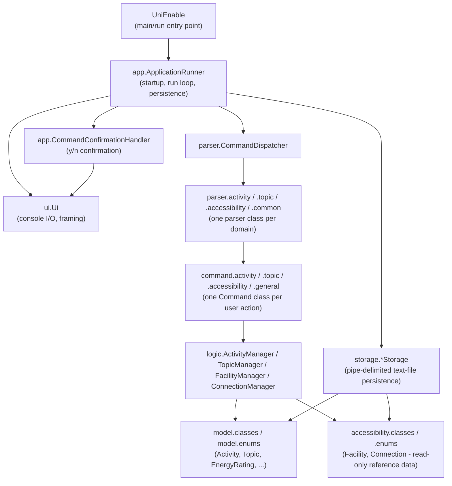

# Developer Guide

## Acknowledgements

- Built from the [se-education.org](https://se-education.org) `Duke` project template (Gradle
  build setup, Checkstyle configuration, text-UI-test harness, and this Developer/User Guide
  skeleton).
- Architecture follows the AB3 (`se-edu/addressbook-level3`) convention of separating UI, logic,
  model, and storage responsibilities, adapted for a CLI-only, single-user application.
- The bundled `facilities.txt`/`connections.txt` sample dataset is digitised from a real NUS FASS
  accessible-route campus map (source PDF kept outside this repo).
- No other third-party libraries are used; the application depends only on the JDK 17 standard
  library and JUnit 5 for testing.

## Design & implementation

### Architecture

UniEnable is a single-user CLI application: it reads one line of input at a time, turns it into a
`Command` object, executes it, and prints the result, saving activity/topic data after every
mutating command.



Each box above is a package-level component:

| Component | Responsibility |
|---|---|
| `UniEnable` | The application's sole public entry point (`main`, and the `run(Path, InputStream)` test seam that end-to-end tests call directly). Delegates immediately to `app.ApplicationRunner`; holds no other logic, since Gradle and the Shadow JAR need this exact class name as the main class. |
| `app` | `ApplicationRunner` coordinates one full run: configuring startup (suppressing JDK logging, showing the welcome message), loading and populating stored data, running the read-execute-print command loop, and persisting activities/topics/settings after every executed command. `CommandConfirmationHandler` owns the y/n confirmation step for the four commands that need one (see below), including EOF-as-cancel handling. Both hold their dependencies (UI, scanner, storage, managers, dispatcher) as fields rather than passing them through parameter lists. |
| `ui` | All console output framing (`Ui`) and activity-to-text formatting (`MessageFormatter`). `Ui` also formats the partial-load-warning block (`showLoadWarnings`); `ApplicationRunner` decides *when* to call it, but not what the warning text looks like. No parsing or business logic. |
| `parser` | Turns one command line into a `Command` object. `CommandDispatcher` routes by command word to a domain-specific parser (`ActivityCommandParser`, `TopicCommandParser`, `FacilityCommandParser`, `ConnectionCommandParser`), which all share small utilities in `parser.common` (`FieldParser`, `DateTimeParser`, `RatingParser`, and `ArgumentTokenizer`/`ArgumentMarker` - see below). |
| `command` | One class per user action (`AddCommand`, `EditCommand`, `FacilityFindCommand`, ...), each holding just the data it needs and an `execute()` method. Commands never parse raw text themselves. A command that needs a confirmation step implements `Confirmable` (see Design considerations). |
| `logic` | In-memory managers: `ActivityManager` (CRUD, duplicate/overlap validation, sorting, "next relevant activity"), `TopicManager` (topic CRUD scoped per category, cascading rename/delete-guard), `FacilityManager`/`ConnectionManager` (read-only lookups over the loaded accessibility dataset), plus `ActivityFilter` (a small value object bundling list/find's filter criteria). `logic.graph` (see Design considerations) is a preparatory addition, not used by any v1.0 command. |
| `model` | Mutable domain objects for user data: `Activity` (abstract base), `FixedActivity`/`FlexibleActivity`, `Topic`, `EnergyRating`/`SensoryRating` (validated 1-5 value objects), and enums (`ActivityCategory`, `ActivityOrder`, `CompletionStatus`, `ScheduleType`). |
| `accessibility` | Immutable domain objects for the read-only reference dataset: `Facility`, `FacilityFeature`, `Connection`, and their enums (`AccessibilityStatus`, `ShelterStatus`, `TraversalType`). Immutable because, unlike activities, this data is never edited in-app. |
| `storage` | Loads/saves the pipe-delimited text files: `ActivityStorage`, `TopicStorage`, `SettingsStorage` (read-write), `FacilityStorage`, `ConnectionStorage` (read-only, from `data/facilities.txt`/`data/connections.txt`), all wrapped by the top-level `Storage` facade. `LoadResult<T>` pairs successfully loaded records with per-line warnings for malformed ones; `SettingsStorage` falls back to the documented default order with a warning rather than failing to start. |
| `exception` | A flat hierarchy under `UniEnableException`, each subtype naming a category shown in `[Error] <category>: <message>` (e.g. `MissingInputException` -> "Missing input", `InvalidActivityException` -> "Invalid input"). Kept flat rather than per-domain, since the categories are about the *kind* of problem, not which feature raised it. |

### A representative flow: editing an activity

`edit` is a good example because it touches every layer and exercises the confirmation step.
Editing activity `1`'s duration (`edit 1 dur/60`) proceeds as follows:

```mermaid
sequenceDiagram
    participant User
    participant Runner as ApplicationRunner
    participant Confirm as CommandConfirmationHandler
    participant Dispatcher as CommandDispatcher
    participant Parser as ActivityCommandParser
    participant Manager as ActivityManager
    participant Cmd as EditCommand
    participant Storage

    User->>Runner: "edit 1 dur/60"
    Runner->>Dispatcher: dispatch(input, now)
    Dispatcher->>Parser: parseEdit(activityManager, topicManager, "1 dur/60")
    Parser->>Manager: getById(1)
    Manager-->>Parser: old Activity
    Note over Parser: builds a complete new Activity,<br/>validating every changed field first
    Parser-->>Dispatcher: EditCommand(1, newActivity)
    Dispatcher-->>Runner: EditCommand
    Runner->>Confirm: confirmIfNeeded(command)
    Confirm->>Cmd: getConfirmation()
    Cmd->>Manager: getById(1)
    Manager-->>Cmd: old Activity
    Note over Cmd: builds diff via MessageFormatter;<br/>returns Confirmation.ask(diff + prompt)
    Cmd-->>Confirm: Confirmation
    Confirm->>User: show diff, "Save changes? (y/n)"
    User->>Confirm: "y"
    Confirm-->>Runner: true
    Runner->>Cmd: execute()
    Cmd->>Manager: replace(1, newActivity)
    Manager-->>Cmd: (validated, replaced)
    Cmd-->>Runner: CommandResult
    Runner->>Storage: saveActivities(activityManager.getAll())
    Runner->>User: framed feedback
```

The key design point: the parser builds a *complete, fully-validated* replacement `Activity`
before `EditCommand` ever touches the manager. If any supplied field fails validation (e.g. an
out-of-range energy rating), the parser throws before `EditCommand` is even constructed, so the
stored activity is never touched — this is what makes edit (and add, delete, topic rename/delete)
atomic: a rejected request always leaves prior state completely unchanged.

### Design considerations

- **v1.0 parsing stays on `FieldParser`; a declarative `ArgumentTokenizer` exists alongside it,
  not in place of it.** Every v1.0 command parser still calls the small stateless `FieldParser`
  (`extractField`/`indexOfMarker`) directly, exactly as before — this bullet's original tradeoff
  (self-contained, easy-to-follow parsers, at the cost of sharp edges like markers that are
  trailing substrings of each other, e.g. `c/` inside `topic/`, needing an explicit boundary rule
  cross-checked in `FieldParserTest.indexOfMarker_noKnownMarkerIsMistakenlyMatchedInsideAnother`)
  still holds for all of v1.0. Technical-debt hardening added `parser.common.ArgumentTokenizer` +
  `ArgumentMarker` as a **declarative alternative** for v2.0 commands with more complex grammars
  (`recommend`, `route`): a per-command marker registry (each marker declared `required`/
  `optional`) tokenized in one pass, reusing `FieldParser`'s own boundary rule so matching stays
  consistent, plus three things `FieldParser` callers previously had to hand-implement themselves:
  required-field checking, fail-fast rejection of an undeclared marker-shaped token anywhere in
  the input (not just leading text), and basic double-quote support so a value may contain spaces
  or another marker's prefix text (e.g. `n/"CG3207 lecture"`, `note/"see c/o front desk"`).
  `ArgumentTokenizerTest` proves field-by-field equivalence with `FieldParser.extractField` for
  representative v1.0 argument strings. No existing parser calls it yet — adopting it for a given
  v1.0 command is a deliberate future migration, not a side effect of it existing.
- **Blank optional fields are treated as absent, not as stored empty strings.** Free-text optional
  fields (`topic/`, `note/`, and `find`'s `k/`) run through a `blankToNull`-style normalisation so
  that `topic/   ` (whitespace only) behaves identically to omitting `topic/` entirely — both for
  storage and for "at least one filter is required" gates. This was fixed in three separate places
  after the same class of bug appeared repeatedly (add/edit's `topic/`/`note/`, `list`/`find`'s
  `topic/` filter, `connection find`'s `from/`/`to/`, and `find`'s `k/`), which is why it is called
  out explicitly here rather than left implicit: any new optional free-text field should apply the
  same normalisation from the start.
- **Storage delimiter is unescaped by design, so user input is validated against it up front.**
  `activities.txt`/`topics.txt` use `|` as a field delimiter with no escaping mechanism. Rather
  than escaping it, the parser layer rejects any `n/`, `topic/`, `note/`, or topic-name value
  containing `|` before the activity/topic is ever created — this avoids a command reporting
  success and then permanently failing to persist on every subsequent save.
- **Cross-field validation lives in the parser layer, not in model constructors.** For example,
  `FixedActivity`'s "end after start" and `FlexibleActivity`'s "duration fits window" checks are
  performed by `ActivityCommandParser` before construction, not inside the model classes. This
  keeps the model classes simple data holders and keeps all user-facing validation messages in one
  place.
- **An activity's topic is validated against `TopicManager`, not stored as a free-floating
  string.** `ActivityCommandParser.parseAdd`/`parseEdit` take a `TopicManager` and reject a
  non-null `topic/` that does not exist under the activity's resulting category, before the
  activity is built. This closes off two related failure modes that a plain string field would
  otherwise allow: referencing a topic that was never created, and an edit that changes category
  silently stranding the activity's existing topic outside the category it is registered under.
  The check runs during parsing, so a rejected request never reaches `confirmIfNeeded()`.
- **Confirmation is generic via a `Confirmable` interface, not a per-command `instanceof` chain.**
  `CommandConfirmationHandler.confirmIfNeeded()` previously named `DeleteCommand`, `EditCommand`,
  `TopicRenameCommand`, `TopicDeleteCommand`, and `ResetCommand` individually in an `instanceof`
  chain — readable at four or five branches, but every new confirmable command (v2.0's
  `recommend` "adopt this recommendation?" step, or `RecurCommand`'s confirmation) would have
  meant editing this class again, violating OCP. Technical-debt hardening replaced this with
  `command.Confirmable` (an interface with one method, `getConfirmation()`) and
  `command.Confirmation` (an immutable three-outcome value: `proceed()` — execute with no prompt,
  e.g. `reset all` with nothing to reset; `cancel(message)` — cancel with no prompt and a custom
  message, e.g. edit with no changed fields; or `ask(prompt)` — show the prompt and read y/n). The
  handler now only checks `instanceof Confirmable` generically; each of the five existing
  commands implements `getConfirmation()` itself, reusing the manager reference it already holds
  to build its own preview — no prompt text, ordering, or EOF/y/n behaviour changed for any
  existing command. `CommandConfirmationHandlerTest` proves this with a locally-defined test
  command that has no relationship to any real command class, demonstrating that a brand-new
  confirmable command works without the handler ever changing.
- **Every confirmation-requiring command validates before prompting, via a side-effect-free
  preflight check.** `delete`/`edit` validate that the target activity exists before showing the
  y/n prompt (`ActivityManager.getById()`, called from the parser); `edit` additionally preflights
  duplicate/overlap conflicts via `ActivityManager.checkNoConflicts()`; `topic rename`/`topic
  delete` preflight existence, duplicate-name, and still-in-use conditions via
  `TopicManager.checkCanRename()`/`checkCanDelete()`. Each preflight check is a thin wrapper that
  the corresponding mutating method (`replace()`, `rename()`, `delete()`) also calls internally,
  so the same validation runs again at execution time as defensive protection against state
  changes between the two calls. Any new confirmation flow should follow this pattern: validate
  everything that would cause a rejection in the parser layer, before a `Command` is ever returned
  for `confirmIfNeeded()` to act on.
- **Three-state accessibility values.** `AccessibilityStatus`/`ShelterStatus` are `YES`/`NO`/
  `UNKNOWN`, not a boolean, so that "no information recorded" is never conflated with "confirmed
  not accessible" — a direct requirement from the project's accessibility principles.
- **The accessibility domain is immutable and entirely separate from activities.** `Facility` and
  `Connection` are read-only reference data loaded once at startup from external text files;
  activities never reference them. This keeps the "activities don't store locations, routes are a
  separate lookup" requirement structurally enforced rather than just documented.
- **`logic.graph.AccessibilityGraph` is a read-only, non-breaking prep layer for v2.0's `route`
  command.** `FacilityManager` and `ConnectionManager` stay completely independent in v1.0, by
  design (previous bullet) — but v2.0 needs Dijkstra-based shortest-path lookups over both
  together, and building that from scratch when v2.0 lands would risk duplicating data or
  destabilising the v1.0 loading path. `AccessibilityGraph` is built once, at the point something
  chooses to construct it, from an already-loaded `FacilityManager`/`ConnectionManager` (nodes =
  facilities, edges = two-way, distance-weighted connections); `getShortestPath(from, to)` runs a
  standard lazy-deletion Dijkstra (valid since every stored connection distance is a positive
  whole number, enforced at load time by `ConnectionStorage`) and returns the ordered facility
  names plus total distance, or `null` if no path exists. **Not referenced by any v1.0 command,
  `CommandDispatcher`, or `ApplicationRunner`** — v2.0's `route` command will be the first caller.
  `AccessibilityGraphTest` verifies both a small synthetic graph and the real bundled NUS FASS
  dataset, with two paths checked by hand against the dataset's own connection notes.
- **`facility validate`/`connection validate` re-run existing load-time checks on demand, and
  change nothing.** `facilities.txt`/`connections.txt` are human-editable, but the only integrity
  check used to run once at startup as an easy-to-miss warning; fixing a mistake meant noticing
  the warning, then restarting to see if the fix worked. Both new commands just call
  `Storage.loadFacilities()`/`loadConnections()` again on demand and report the returned
  `LoadResult`'s warnings (or "no issues found") — the exact same validation `FacilityStorage`/
  `ConnectionStorage` already perform, not a second implementation of it. Deliberately read-only:
  neither command writes to disk or replaces the already-loaded `FacilityManager`/
  `ConnectionManager`, matching the "validation only, no silent repair" requirement for
  accessibility-critical data. `CommandDispatcher` now holds a `Storage` reference (previously
  only `ApplicationRunner` did) so these commands can re-read the raw files without duplicating
  `Storage`'s path-resolution logic — the only wiring change this required outside the two new
  command classes and their parser methods. `facility reset-default` (this item's explicitly
  optional stretch goal, restoring the bundled defaults with confirmation) was not implemented in
  this pass.

## Product scope

### Target user profile

UniEnable serves two equally important personas, both entering an unfamiliar university,
internship, or entry-level work routine, both able to type comfortably and both preferring
predictable CLI interaction over a GUI:

- **Sam**, a tertiary student with ASD or ADHD, who can become overwhelmed by dense schedules,
  benefits from concise default output with optional detail, needs to retrieve "what's next"
  without reading a full day's itinerary, and needs specific (not vague) error messages.
- **Jordan**, a tertiary student who uses a wheelchair, who needs advance accessibility
  information (step-free entrances, lifts, ramps, rest points), a way to look up accessible routes
  between known facilities, and clear warnings when the local dataset is incomplete. Wheelchair use
  does not imply any difficulty typing or using a keyboard.

### Value proposition

Tertiary students with ASD or ADHD, and wheelchair users, entering unfamiliar routines often need
to weigh scheduling, sensory demands, recovery time, and accessible travel separately, making it
hard to build a practical daily plan around individual needs. UniEnable helps by combining
concise, preference-aware daily scheduling with separate, locally maintained accessibility and
route reference information, entirely offline in a fast CLI.

## User Stories

Priorities: `***` must have, `**` should have, `*` nice to have. Selected v1.0 stories (the
complete v1.0/v2.0 list lives in the team's prioritised user-story backlog, maintained outside
this repository):

| Priority | As a ... | I want to ... | So that I can ... |
|---|---|---|---|
| `***` | student managing an unfamiliar routine | add an activity with its essential scheduling information | include it in my daily itinerary |
| `***` | student managing multiple commitments | view activities in input, time, or chronological order | review my activities in the sequence that best matches my planning needs |
| `***` | student managing multiple commitments | find activities using keywords and narrow results by category, topic, or date | retrieve relevant activities without scanning my entire itinerary |
| `***` | student | change one or more details of an existing activity while keeping other details unchanged | update my itinerary with less typing |
| `***` | student | remove an activity whenever I consider it obsolete | reduce unnecessary schedule information and cognitive load |
| `***` | student | mark an activity as completed or change it back to incomplete | distinguish finished activities from unfinished ones |
| `***` | student | organise each activity under a fixed category | maintain a consistent structure for my commitments |
| `***` | student | view my next relevant activity in a concise format | know what to do next without reading my entire itinerary |
| `***` | student | record an activity's energy demand, sensory load, and optional notes | understand its demands when planning |
| `***` | student who uses a wheelchair | view pre-recorded accessibility information for known facilities | prepare for possible barriers |
| `***` | student who uses a wheelchair | view pre-recorded accessibility and distance information for connections | prepare for travel using locally maintained reference data |
| `**` | student | create and manage optional topics within a fixed category | organise related commitments at a level meaningful to me |

## Non-Functional Requirements

- Java 17, primarily object-oriented design.
- CLI as the sole interaction mode; single-user, offline operation with no dependency on a private
  remote server, external APIs, or a DBMS.
- Platform-independent behaviour on Windows, Linux, and macOS.
- Local, human-editable text-file storage; no installer required; ships as a standalone executable
  JAR.
- Fast startup and response, suitable for users who prefer direct keyboard interaction over a
  mouse-driven interface.

## Glossary

- **Activity** - A user-recorded item on the itinerary: either *fixed* (a confirmed start/end
  time) or *flexible* (an earliest-start/latest-end window plus a required duration).
- **Category** - One of four fixed top-level groupings (`ACADEMIC`, `CCA`, `WORK_INTERNSHIP`,
  `OTHERS`) every activity belongs to.
- **Topic** - An optional, user-created grouping within a category (e.g. a specific module or
  workplace); at most one per activity, one level deep.
- **Energy rating / Sensory rating** - A user-entered `1`-`5` planning value describing expected
  energy demand or sensory load; self-reported, not a medical assessment.
- **Facility** - A read-only reference record for a physical location (e.g. a building), including
  its accessibility features (lifts, ramps, step-free entrances, etc.).
- **Connection** - A read-only, weighted, two-way link between two facilities, carrying a distance
  in metres, a traversal type, and an accessibility status.
- **Accessibility status** - One of `YES`/`NO`/`UNKNOWN`; `UNKNOWN` is never treated as
  accessible.

## Instructions for manual testing

These instructions cover exploratory manual testing on top of the automated suites described
below; they assume familiarity with the [User Guide](UserGuide.md)'s command reference.

### Automated tests (run these first)

```bash
./gradlew clean test checkstyleMain checkstyleTest
bash text-ui-test/runtest.sh
./gradlew shadowJar
```

- `./gradlew test` runs the full JUnit suite (see the test report for the current pass count;
  avoid quoting a specific number here, since it will drift as tests are added).
- `text-ui-test/runtest.sh` (or `.bat` on Windows) rebuilds the JAR, feeds it the scripted
  `text-ui-test/input.txt`, and diffs the output against `text-ui-test/EXPECTED.TXT`; it exercises
  the v1.0 command surface end-to-end, including many boundary cases and error paths (see the
  script itself for exactly what it covers — it grows as new scenarios are added, so treat any
  specific line count here as a snapshot, not a guarantee). It clears `text-ui-test/data/` before
  each run for a deterministic starting state.

### Manual exploratory testing

1. **Start from a clean slate.** Run the JAR from an empty working directory so `data/` is created
   fresh:
   ```bash
   java -jar build/libs/unienable.jar
   ```
2. **Activity lifecycle.** Try `add` for both a `FIXED` and a `FLEXIBLE` activity, then `list`,
   `view ID`, `find k/KEYWORD`, `edit ID FIELD/VALUE`, `mark ID`/`unmark ID`, and `delete ID`
   (confirm with `y` and `n` on separate attempts to check both paths). See `guide add`/`guide
   find` for ready-to-copy examples.
3. **Validation and atomicity.** Deliberately submit an invalid edit (e.g. an out-of-range
   `energy/` value, or a `from/`/`to/` pair with the end before the start) and confirm the
   activity is completely unchanged afterwards (`view ID` again).
4. **Topics.** `topic add`, assign an activity to it via `add ... topic/NAME`, `topic rename` it
   (check the activity's topic updates too), then try `topic delete` while it is still in use
   (should be rejected) and again after reassigning/removing the activity.
5. **Accessibility reference data.** `facility list`, `facility view NAME`, `facility find
   type/TYPE`, `connection list`, `connection view ID`, `connection find from/NAME`. This data is
   read-only — there is no command that edits it. To test the malformed-data-file path, stop the
   application, edit `data/facilities.txt` or `data/connections.txt` to add an invalid line (e.g.
   an unknown feature type), and restart: the app should report a `[Warning] Partial data loaded`
   message naming the file and line, then continue with the rest of the data loaded normally. Then
   run `facility validate`/`connection validate` **without restarting** — they should report the
   exact same issue(s) on demand, without modifying either file (check with `git diff` or a hash
   of the file before/after).
6. **Persistence.** After making changes, exit with `bye` and restart the JAR; confirm activities,
   topics, and completion state survived.
7. **The built-in guide.** Run `guide` and try both a menu number (`guide 2` or bare `2` right
   after the menu) and a topic keyword (`guide add`) to confirm both resolve to the same topic.
