# UniEnable Developer Guide

## 1. Introduction

UniEnable is a single-user, offline Java 17 command-line application for planning activities and
consulting local accessibility reference data. This guide describes the implemented v1.0 system,
with emphasis on its activity-conflict refactor, recurrence workflow, persistence guarantees, and
read-only accessibility features, plus v2.0's shipped accessible route search (`route`, Section
12), planning dashboard (`dashboard`, Section 13), read-only timetable (`timetable`, Section 14),
and global planning preferences (`preference`, Section 15).

The project began from the se-education.org Duke template. Its Gradle setup, Checkstyle rules, and
text-UI harness follow that ecosystem; the application design and domain behaviour described here
are UniEnable-specific. Production code uses only the JDK. JUnit 5 is used for tests.

## 2. Setting up and getting started

Prerequisites:

- JDK 17;
- Git;
- an IDE with Gradle support, or a terminal.

Clone the repository and import it as a Gradle project. Useful commands are:

```bash
./gradlew clean check
./gradlew javadoc
./gradlew run
./gradlew releaseZip
```

On Windows, use `gradlew.bat`. The release task creates
`build/distributions/unienable.zip`; the ZIP contains `unienable.jar` and
`data/academic-calendar.txt`. Run the extracted JAR from the directory that contains that `data`
folder.

## 3. Architecture

The entry point delegates to `ApplicationRunner`, which owns startup, loading, the command loop,
confirmation, saving, shutdown, and in-memory recommendation proposal lifecycle. Parsing produces
command objects; commands call managers or stateless services; managers operate on domain objects
or hold run-scoped state; storage translates between domain objects and local text files.

<p align="center">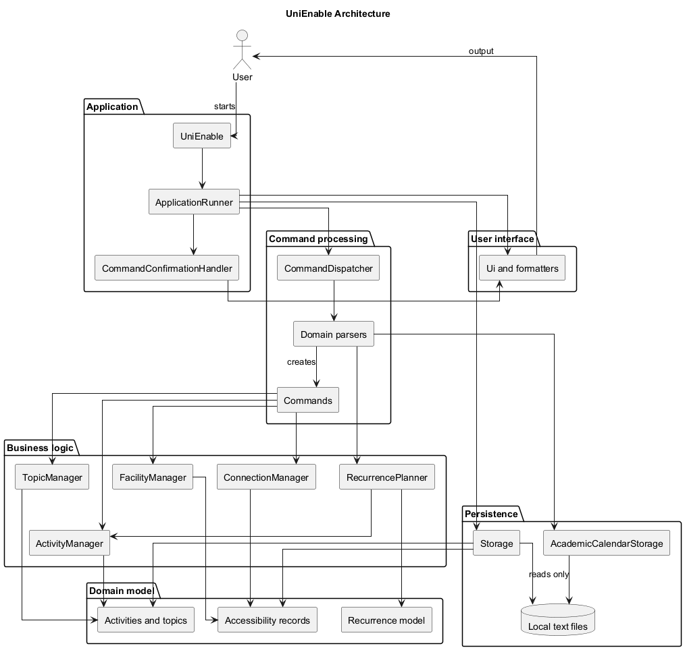</p>

The academic calendar is deliberately outside the main `Storage` facade. It is a supplied,
read-only recurrence resource loaded lazily by `RecurCommandParser`, whereas the facade coordinates
application-owned files and the accessibility reference dataset.

## 4. Main components

| Component | Responsibility |
|---|---|
| `UniEnable` | Public entry point; delegates immediately to `ApplicationRunner`. |
| `app` | Configures logging, loads state, runs the read-confirm-execute-save loop, restores failed mutations, and formats lifecycle errors. |
| `ui` | Frames console output and formats activities and recurrence previews; it contains no business rules. |
| `parser` | Routes a line through `CommandDispatcher`, validates syntax and values, and constructs a command. |
| `command` | Represents one user action through `execute()`; confirmable commands also provide a prompt or menu. |
| `logic` | Owns in-memory activity/topic/preference/recommendation state, read-only accessibility lookups, filters, conflict policy, recurrence planning, and deterministic recommendation calculation. |
| `model` | Defines activities, topics, preferences, ratings, enums, academic-calendar records, recurrence plans, and recommendation proposals. |
| `accessibility` | Defines immutable facility, feature, connection, and three-state accessibility records. |
| `storage` | Loads validated text records and transactionally saves activities, topics, settings, and preferences. |
| `exception` | Provides user-facing checked exception categories such as invalid input, conflict, and storage error. |

`ActivityManager` owns the activity list, permanent-ID counter, saved ordering, CRUD operations,
queries, and atomic batch mutation. It delegates scheduling-conflict policy to
`ActivityConflictChecker`. `TopicManager` owns topics and maintains their relationship to
activities. `FacilityManager` and `ConnectionManager` expose immutable loaded records through
read-only lookup operations.

## 5. Activity model

Every activity has a permanent ID, description, category, date, ratings, optional topic and note,
and completion status. A `FixedActivity` has a start and end time. A `FlexibleActivity` has an
earliest start, latest end, and required duration.

<p align="center">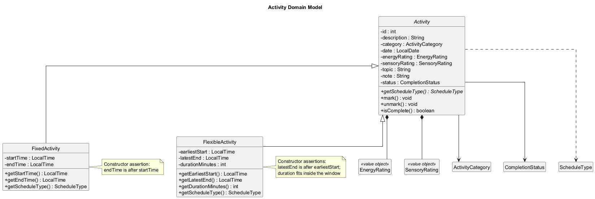</p>

Activities are mutable because edits, completion changes, and topic renames update existing user
state. Ratings are validated value objects. Constructors and timing update methods use explicit
argument checks for the end-after-start and duration-fits-window invariants, so invalid model
state is rejected even when Java assertions are disabled. Callers additionally validate untrusted
input before construction, as described in Section 14.

IDs stay a plain `int` end to end rather than widening the whole model to `long`, but every
`ActivityManager` site that advances the next-ID counter (`loadAll`, `restoreState`, `add`,
`addAllAtomically`) now guards against `int` overflow instead of performing raw `+ 1`/`++`
arithmetic: `loadAll`/`restoreState` compute the candidate next ID as `long` so the comparison
itself cannot wrap, and an `idSpaceExhausted` flag is set once that value would exceed
`Integer.MAX_VALUE`. `getNextId()`, `add()`, and `addAllAtomically()` all throw
`IllegalStateException` once exhausted rather than silently reusing or wrapping an ID; a batch call
is additionally rejected atomically upfront if it would need more IDs than remain.
`RecurrencePlanner`'s own candidate-ID arithmetic (`nextId + toCreate.size()`) uses
`Math.addExact` for the same reason. This is intentionally a defensive guard for an
astronomically unlikely scenario (billions of activities in one data file), not a change to
normal ID behaviour.

## 6. Command and parser design

`CommandDispatcher.dispatch(input, now)` separates the first command word from its arguments and
routes to a domain parser. Parsers validate raw text and construct complete command objects;
commands never parse their own input. `now` is injected so date-sensitive parsing is deterministic
in tests.

Adding an activity illustrates the normal path. The parser obtains the next permanent ID,
validates fields, and constructs the correct subtype. The command asks `ActivityManager` to add it,
the manager delegates conflict policy, and `ApplicationRunner` saves before showing success.

<p align="center">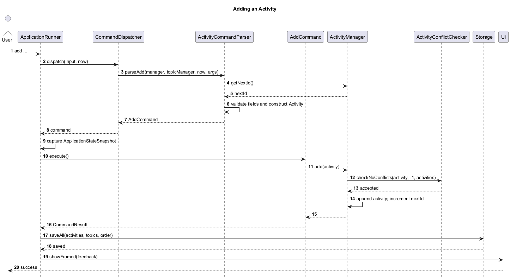</p>

Plain confirmations use `Confirmable`; the three-choice reset uses `MenuConfirmable`.
`CommandConfirmationHandler` owns input handling for both shapes, keeping confirmation mechanics
out of commands and the runner.

## 7. Conflict validation

`ActivityConflictChecker` is a package-private, final, stateless helper owned by
`ActivityManager`. Its single package-visible operation receives a candidate, a permanent ID to
exclude, and the list to inspect. The manager exposes a public facade for recurrence preflight and
retains ownership of all mutation and ID rules.

<p align="center">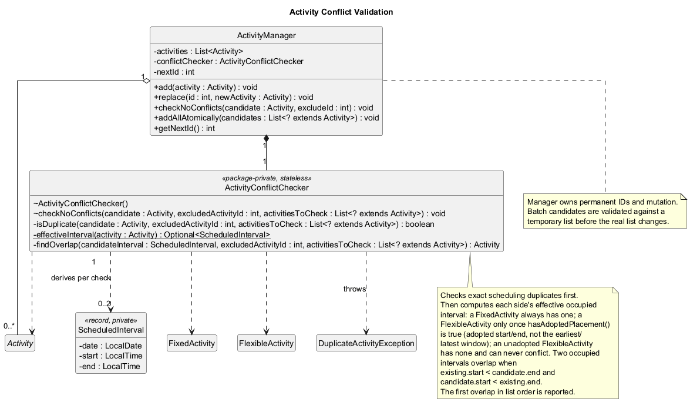</p>

Conflict rules are applied in this order:

1. Check exact scheduling duplicates. Description comparison is exact and case-sensitive; the
   date and schedule type must match. Fixed activities additionally compare start and end;
   flexible activities compare earliest start, latest end, and duration. ID, category, topic,
   note, ratings, and completion are ignored.
2. If no duplicate exists, compute the candidate's *effective occupied interval* - a private
   `effectiveInterval(Activity)` helper returning `Optional<ScheduledInterval>` (a small
   `record(LocalDate date, LocalTime start, LocalTime end)`): a `FixedActivity` always has one; a
   `FlexibleActivity` has one only once `hasAdoptedPlacement()` is true (start/end become the
   adopted start/end, not the earliest/latest window); an unadopted `FlexibleActivity` has none. If
   the candidate has no effective interval, the overlap check is skipped entirely - a mere
   scheduling window is never occupied time. Otherwise, find the first *other* activity in list
   order that also has an effective interval and overlaps it. The half-open predicate is unchanged:
   `existing.start < candidate.end && candidate.start < existing.end`, now compared against each
   side's effective interval rather than raw `FixedActivity` fields.

Consequently, adjacent occupied intervals are accepted, an unadopted flexible activity's window
overlapping anything is always accepted (it is never occupied time), and two activities only
conflict when *both* have a real committed schedule - fixed, or flexible-and-adopted, in any
combination. Exact flexible duplicates (adopted or not) are still separately rejected by rule 1.
Completed activities participate exactly like incomplete ones. Duplicate failure takes precedence
over overlap failure. `storage.ActivityStorage.validateAgainstAlreadyLoaded` mirrors this same
effective-interval concept independently (storage deliberately does not import `logic`, the same
layering rule Section 11 documents for date/time parsing), so a hand-edited `activities.txt`
containing a `FIXED` line that overlaps an already-loaded adopted `FLEXIBLE` line is rejected at
load time too, not just through `add`/`edit`/`recur`.

Edit validation excludes every activity whose permanent ID equals the supplied exclusion ID. This
prevents an activity from conflicting with itself without relying on list position. For batches,
`ActivityManager.addAllAtomically` also validates that candidate IDs begin at `nextId` and increase
by one; permanent-ID validation therefore remains a manager responsibility.

## 8. Editing activities

`ActivityCommandParser.parseEdit` loads the current activity, merges supplied fields into a
complete replacement object, validates type-specific requirements and topic membership, and calls
`ActivityManager.checkNoConflicts(replacement, id)` before a confirmation is shown. A doomed edit
therefore does not ask the user to approve it.

**Adopted-placement carry-over.** `EditCommandParser.buildFlexible` always constructs a brand-new
`FlexibleActivity` for the replacement (the runtime type can't be mutated in place across a
possible `type/` change), which by construction starts unadopted. If the edit is on an already
same-type `FlexibleActivity` (`typeChanged == false`), `buildFlexible` explicitly re-applies the
old object's `adoptedStartTime` via `FlexibleActivity.canAdoptAt`/`setAdoptedStartTime` once the
new window/duration is resolved - preserving it whenever it still fits, and leaving it cleared
(never re-applied) when a scheduling edit (`date/`, `earliest/`, `latest/`, `dur/`) narrows the
window out from under it. `MessageFormatter.appendTimingChanges` mirrors this with its own
`adopted` Before/After line whenever the resulting adopted state differs (including to `None`), so
the confirmation preview never lets a placement disappear silently. A `type/` change away from
`FLEXIBLE`, or the source activity already being `FixedActivity`, has no adopted state to carry -
`buildFixed` is unaffected.

If this edit actively supplies a new `date/` or start-time field, `EditCommand` also implements
`PreExecutionValidatable`: immediately after the user answers "Save changes? (y/n)" and
immediately before execution, `ApplicationRunner` calls `validateBeforeExecution(now)` with a
freshly-sampled `now`, re-running `logic.validation.ActivityTimeValidator.requireNotPastIfToday`
against the newly-requested start time - since the original check at parse time ran before the
confirmation prompt was shown, and a real amount of time can pass before the user answers it. An
edit that never touches timing skips this re-check entirely, since its (unchanged) carried-over
start time is allowed to already be in the past. `ActivityTimeValidator` (not
`parser.common.DateTimeParser`, which `EditCommand` would otherwise need to reach only for this one
rule) is the neutral home for this check specifically so `command` never depends on `parser`:
`DateTimeParser`'s own `requireNotPastIfToday` now just delegates to it, so every existing
parse-time caller is unaffected.

After confirmation, `EditCommand.execute` calls `ActivityManager.replace`. `replace` finds the
target by permanent ID and repeats the same conflict check immediately before replacing the list
entry. This defensive execution-time validation protects against state changes between parsing and
execution.

<p align="center">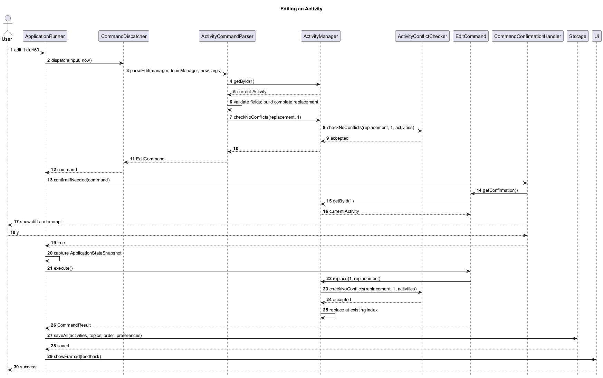</p>

Because the replacement is complete and no field of the stored object is changed before the
manager accepts it, a validation failure leaves the previous activity unchanged. A later save
failure is handled by the broader rollback mechanism in Section 10.

## 9. Recurring activities

`recur TASK_ID week WEEK_SPEC` is implemented in v1.0 for eligible fixed academic class sessions.
The parser obtains the source activity, applies the shared class-schedule eligibility rule, parses
the week specification, loads one cached academic-calendar snapshot, and asks
`RecurrencePlanner` for a side-effect-free plan.

<p align="center">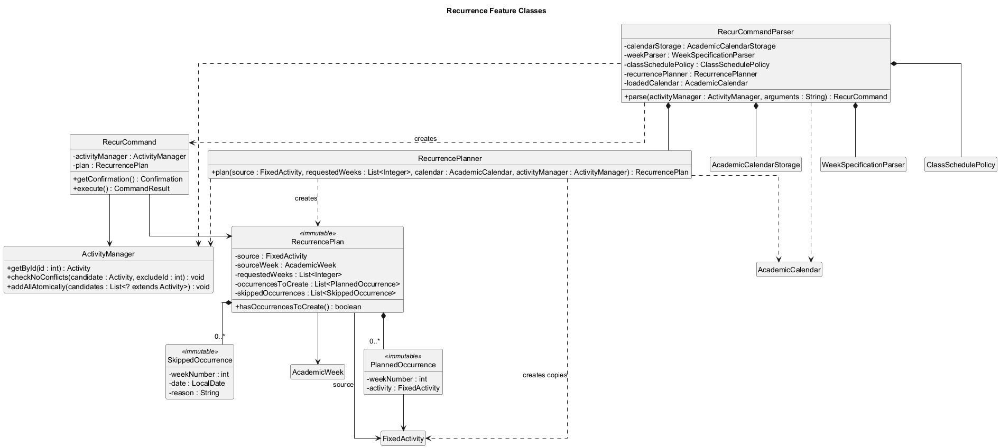</p>

The source must fall in an instructional week, and the requested weeks must include that source
week. For each requested week, the planner finds the matching weekday from the calendar's own date
range rather than adding seven-day offsets. It skips the source date, a no-class date, or the first
existing fixed occurrence with the same description, date, start, and end. Generated copies retain
the source metadata but start incomplete.

`RecurrencePlanner.plan` also takes `now` (threaded from `CommandDispatcher.dispatch` through
`RecurCommandParser.parse`, the same seam every other time-sensitive command uses - no direct
`.now()` call anywhere in this path), and `requireNotPast` rejects any target date - other than
the source's own, already-skipped date - that resolves before `now`'s date, or to `now`'s own date
at a time not after `now`'s time (reusing the exact two-tier shape of
`DateTimeParser.parseNotBeforeDate`/`requireNotPastIfToday`, just applied to the source's inherited
start time rather than a freshly typed one). This runs inline in the same per-week loop as the
no-class/duplicate skip checks, so it inherits their existing "this happens entirely inside
`plan()`, before `RecurCommand` exists" atomicity guarantee for free - no restructuring was needed
to make a past occurrence reject the whole batch before the confirmation preview is ever built.

Each remaining candidate is preflighted through `ActivityManager.checkNoConflicts`; a conflict
aborts the entire `plan()` call immediately (before `RecurCommand` even exists, so nothing has been
mutated), with the underlying conflict message rewrapped as `"Week N (date): <reason>"` so the
failure names exactly which teaching week and calendar date caused it, not just the conflicting
activity. This holds for a `WEEK_SPEC` of any size, including a single range spanning a whole
semester (`week 1 to 13`) - a conflict on the very last requested week aborts the whole batch the
same as a conflict on the first. The immutable `RecurrencePlan` records both planned and skipped
occurrences so `RecurCommand` can present a full preview without changing state.

<p align="center">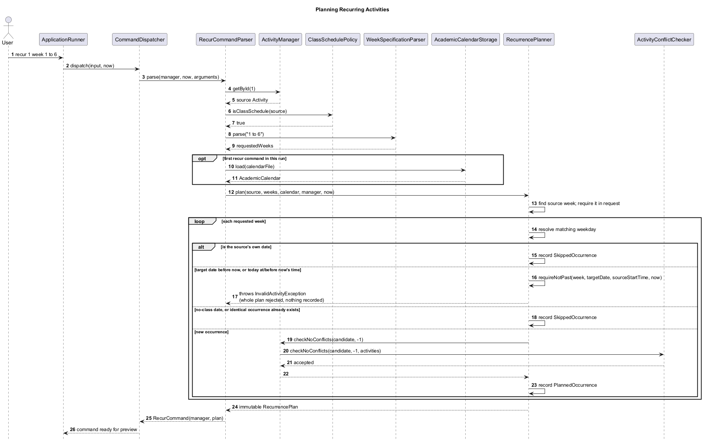</p>

After confirmation, `RecurCommand.execute` extracts the planned fixed activities and calls
`ActivityManager.addAllAtomically`. The manager builds a temporary validated list. Candidate by
candidate, it checks the expected permanent ID and conflicts against existing activities plus all
earlier candidates in that batch. Only after every candidate passes does it append the complete
batch and advance `nextId`.

<p align="center">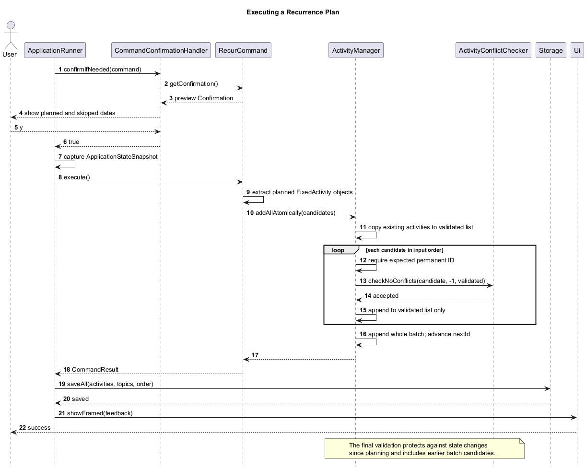</p>

This final revalidation is deliberate: the preview is informative, but execution remains safe if
state changed after planning. Any failure leaves the real activity list and ID counter unchanged.

## 10. Atomic mutation and rollback

Each command declares a `CommandEffect`. Query commands inherit the explicit `ReadOnlyCommand`
contract; commands that alter persistent state declare `MUTATING` beside their implementation.
`Command.getEffect()` is abstract, so a new command cannot compile until its effect is chosen. A
command whose execution may be a no-op (reset or an already-applied preference operation) also
reports whether this invocation has a state change. `ApplicationRunner` therefore has no central
`instanceof` list to maintain. `CommandTransactionExecutor.execute` captures a deep `Snapshot` of
activities and topics plus the exact `nextId`, saved order, and immutable preference profile
immediately before a mutating command runs, and restores it itself if `command.execute()` throws.

Success feedback is withheld until `Storage.saveAll` succeeds. `ApplicationRunner.trySave` catches
both the documented checked `StorageException` and an unanticipated unchecked `RuntimeException`
from `saveAll` (e.g. a bug inside a serializer), reporting either as a save failure the same way;
`ApplicationRunner.processCommand` then calls the same `CommandTransactionExecutor.Execution
.rollback()` used for an execution-time failure, restoring the pre-command snapshot through
`ActivityManager.restoreState`, `TopicManager.loadAll`, and `PreferenceManager.setProfile`. The
attempted command is therefore never left partially applied in memory, regardless of whether
`saveAll` failed in its documented way or in an unanticipated one. After a save failure the
unsaved-change flag remains set so `bye` retries and cannot falsely claim that data was saved.

<p align="center">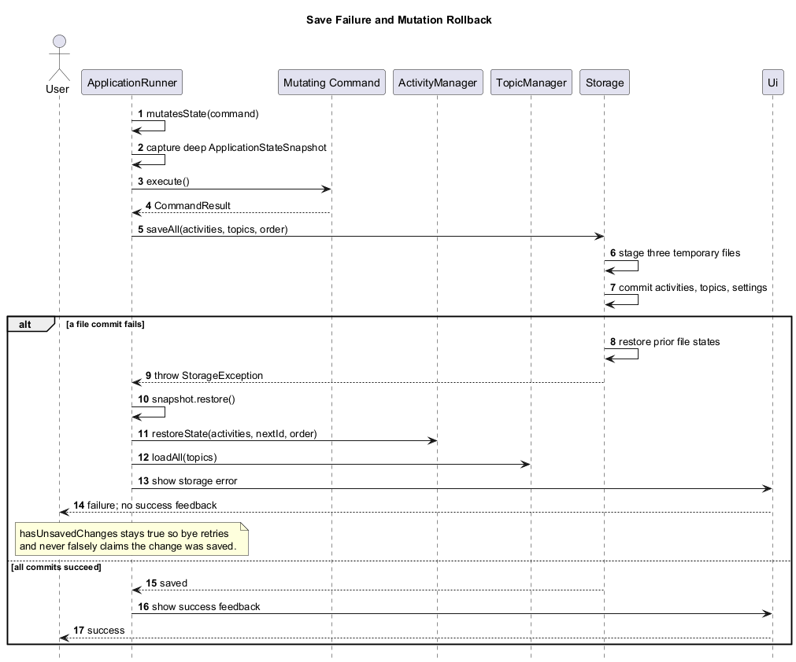</p>

There are two complementary rollback layers:

- in-memory rollback in `CommandTransactionExecutor` restores the pre-command object graph and
  counters, whether the failure originated inside the command itself or in a later save;
- file rollback in `Storage` restores the prior persisted files if a staged multi-file commit
  fails partway through.

## 11. Storage

The `Storage` facade owns loaders for activities, topics, settings, preferences, facilities, and
connections. Application-owned planning state is pipe-delimited in `activities.txt`,
`topics.txt`, `settings.txt`, and `preferences.txt`. `saveAll` stages all four temporary files,
checks destinations, retains backups, and commits them as one operation; a later caught failure
triggers restoration of earlier file states. Backup creation itself is covered by cleanup, so a
failure partway through that phase does not leak earlier backup files. Each destination replacement
requests `ATOMIC_MOVE` and explicitly falls back when the file system does not support it.

The transaction guarantee covers caught in-process I/O failures. A process termination or power
loss between the four destination moves can still expose mixed generations; the file set is not
claimed to be fully crash-atomic.

<p align="center">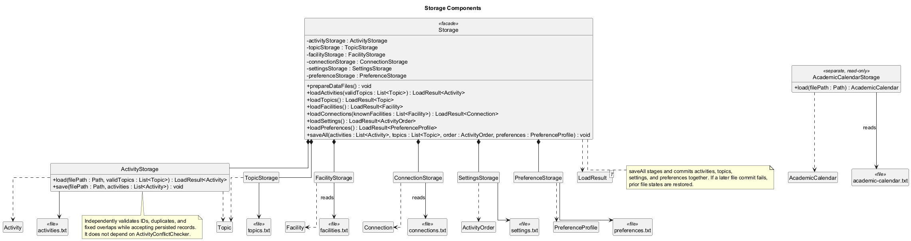</p>

`ActivityStorage` treats persisted lines as untrusted. It validates each accepted record against
earlier accepted records for duplicate IDs, exact scheduling duplicates, and occupied-interval
overlap (a fixed activity, or a flexible activity whose persisted trailing `adoptedStartTime`
field is non-empty - the same effective-occupied-interval concept Section 7 defines, mirrored here
independently since storage does not depend on `logic`), in addition to field, timing, rating,
status, and topic-reference checks. Invalid lines become line-specific load warnings rather than
entering the manager.

Storage deliberately does not depend on `ActivityConflictChecker`. The checker is a logic-layer
policy for proposed mutations, while storage is an independent trust boundary responsible for
rejecting corrupt persisted records before `ActivityManager.loadAll` receives them. This avoids a
storage-to-logic dependency and allows each boundary to report errors appropriate to its caller.

`FacilityStorage` and `ConnectionStorage` load read-only reference files. The separate
`AcademicCalendarStorage` strictly validates the supplied calendar only when recurrence first
needs it; UniEnable never creates, repairs, or writes that file.

## 12. Accessibility functionality

Facilities contain immutable feature records. Connections are immutable two-way reference links
with distance, traversal type, shelter status, accessibility status, and optional barrier/notes.
`YES`, `NO`, and `UNKNOWN` are separate states so missing knowledge is never presented as confirmed
accessibility.

<p align="center">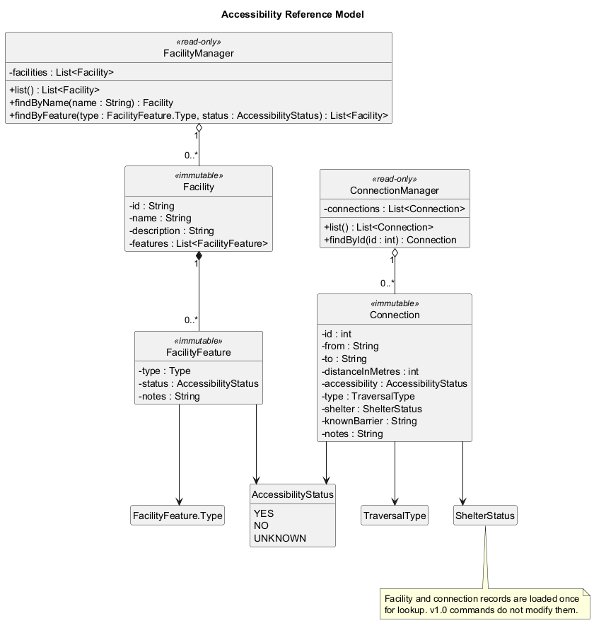</p>

`FacilityManager` supports list, case-insensitive name lookup, and feature/status filtering.
`ConnectionManager` supports list and permanent-ID lookup; connection commands perform their own
documented filters. `facility validate` and `connection validate` rerun the same storage checks on
demand without replacing loaded records or modifying either file.

### Accessible route search (`route`)

`route from/FACILITY to/FACILITY` finds the shortest confirmed-accessible path between two known
facilities, using each connection's `distanceInMetres` as the Dijkstra weight and only connections
with `accessibility == YES` as eligible edges.

<p align="center">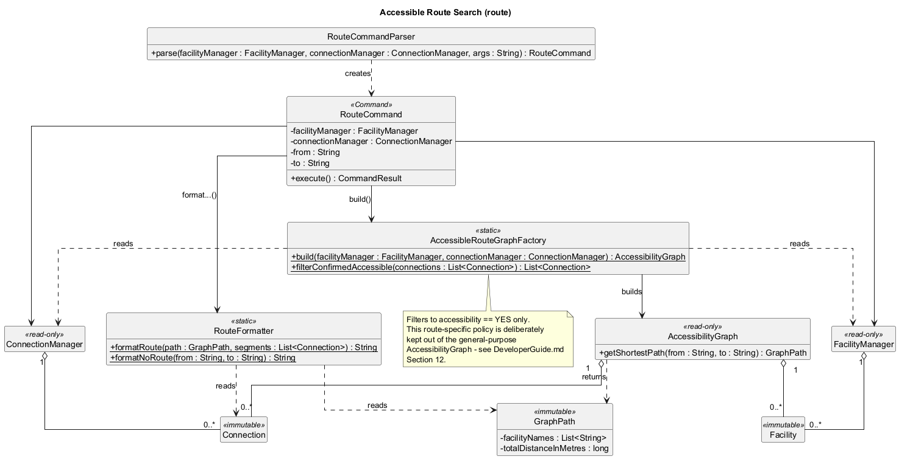</p>

**Cumulative distance is `long`, individual edges stay `int`.** `Connection.distanceInMetres`
remains `int`, since a single persisted connection distance is already bounded by that type.
`AccessibilityGraph`'s Dijkstra frontier (`QueueEntry.distanceInMetres`), its `bestDistance` map,
and `GraphPath.totalDistanceInMetres` are all `long`, because a multi-hop route's *cumulative*
distance can exceed `Integer.MAX_VALUE` even when no individual edge does - a plain `int` running
total would silently wrap and could corrupt the shortest-path comparison. `reconstructPath`
additionally tracks a `visited` set while walking the predecessor chain and throws
`IllegalStateException` if a facility is revisited, so a corrupted `previous` map fails fast
instead of looping indefinitely.

**`Edge`/`GraphPath` carry the actual `Connection` used per hop, not just distances and names.**
`AccessibilityGraph.Edge` holds the originating `Connection` object (not a bare `int` distance);
the relaxation loop that updates `bestDistance`/`previous` on a winning candidate now also records
that hop's `Connection` into a parallel `Map<String, Connection> viaConnection`, and
`reconstructPath` walks both maps together to build `GraphPath`'s `List<Connection> connections`
(one entry per consecutive facility pair, in travel order) alongside its facility-name list. This
closes a real bug: when two facilities have more than one confirmed-accessible connection between
them (parallel edges, e.g. a shorter ramp and a longer path), the distance actually summed into
`totalDistanceInMetres` and the connection object shown for that hop are now guaranteed to be the
same one Dijkstra selected, since both are recorded at the exact moment a shorter distance is
found - there is no longer a separate, later re-lookup that could disagree with Dijkstra's own
choice among several connections sharing an endpoint pair.

**Why the `YES`-only filter lives in `logic.route.AccessibleRouteGraphFactory`, not in
`logic.graph.AccessibilityGraph`.** `AccessibilityGraph` was built during v1.0 hardening as
generic, policy-free Dijkstra-prep infrastructure over *any* facility/connection dataset - its own
class Javadoc says so, and its existing test suite builds graphs from datasets that mix accessible
and non-existent connections without any status opinion. Folding "only `YES` connections are
usable" into it would collapse a reusable graph algorithm and one command's business rule into a
single class, and would silently narrow what any future caller of `AccessibilityGraph` could do
with it. `AccessibleRouteGraphFactory.build(FacilityManager, ConnectionManager)` instead filters
`connectionManager.list()` down to `AccessibilityStatus.YES` connections and builds the existing
graph over exactly that filtered list - route policy and graph algorithm stay in separate classes,
and `AccessibilityGraph` itself gained only a policy-neutral `(List<Facility>, List<Connection>)`
constructor overload (the manager-based constructor now delegates to it) so the factory never
needs to manufacture a throwaway `ConnectionManager` purely to hold a filtered list. Every existing
`AccessibilityGraphTest` case is unaffected, since the manager-based constructor's own behaviour is
unchanged.

Because `FacilityStorage`/`ConnectionStorage` already reject non-positive/duplicate IDs, malformed
lines, and unknown-facility endpoints at load time (Section 11), and `ApplicationRunner` only ever
builds `FacilityManager`/`ConnectionManager` from an already-validated `LoadResult`, the route
graph factory performs no second validation pass of its own - by the time any command runs, the
managers can only contain trusted, self-consistent records. `route`'s source and destination
naming the same known facility is a successful zero-length result (single-facility chain, `0 m`),
not an error, since `AccessibilityGraph.getShortestPath` already returns that result correctly for
matching endpoints. Two known facilities with no confirmed-accessible path between them get a
"No supported accessible route was found..." message rather than an exception, worded to state
only that UniEnable's local dataset has no confirmed path - never that no real-world accessible
route exists. Only an unrecognised facility name raises `InvalidIndexException`.

`RouteCommand` reads `GraphPath.getConnections()` directly to obtain each segment's own distance,
traversal type, shelter status, and optional barrier/notes for display - it no longer performs any
connection lookup of its own. (Before the parallel-edge fix above, `RouteCommand.resolveSegments`/
`findConnectionBetween` used to re-derive a connection per consecutive facility pair by scanning
the `YES`-only connection list for the first endpoint match, with no way to prefer the specific
connection Dijkstra had actually used when several shared an endpoint pair - that method no longer
exists.) Segment display direction always follows the path's own travel direction, not a
connection's stored (and irrelevant, since every connection is two-way) `from`/`to` order.
`ui.accessibility.RouteFormatter` is pure text formatting with no routing decisions of its own.
`route` never estimates travel time and never claims real-time verification or a guarantee of
real-world accessibility.

<p align="center">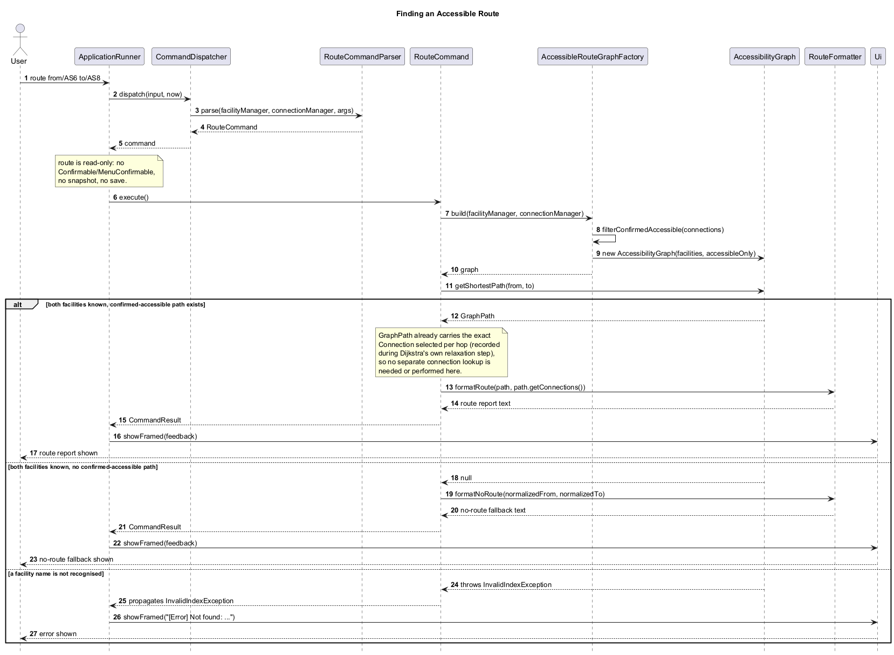</p>

## 13. Accessible planning dashboard

`dashboard today|tomorrow|date/YYYY-MM-DD|this week|next week [detail]` calculates a read-only planning-load
summary directly from `ActivityManager`'s current in-memory state every time it runs - it is a
**derived view, not a stored entity**: there is no dashboard persistence file, no dashboard model
saved to disk, and nothing about it survives between commands except what `ActivityManager` itself
already owns. This keeps it consistent with the rest of the read-only accessibility commands
(`facility`/`connection`/`route`) and avoids a second source of truth that could drift from the
activities it summarises.

<p align="center">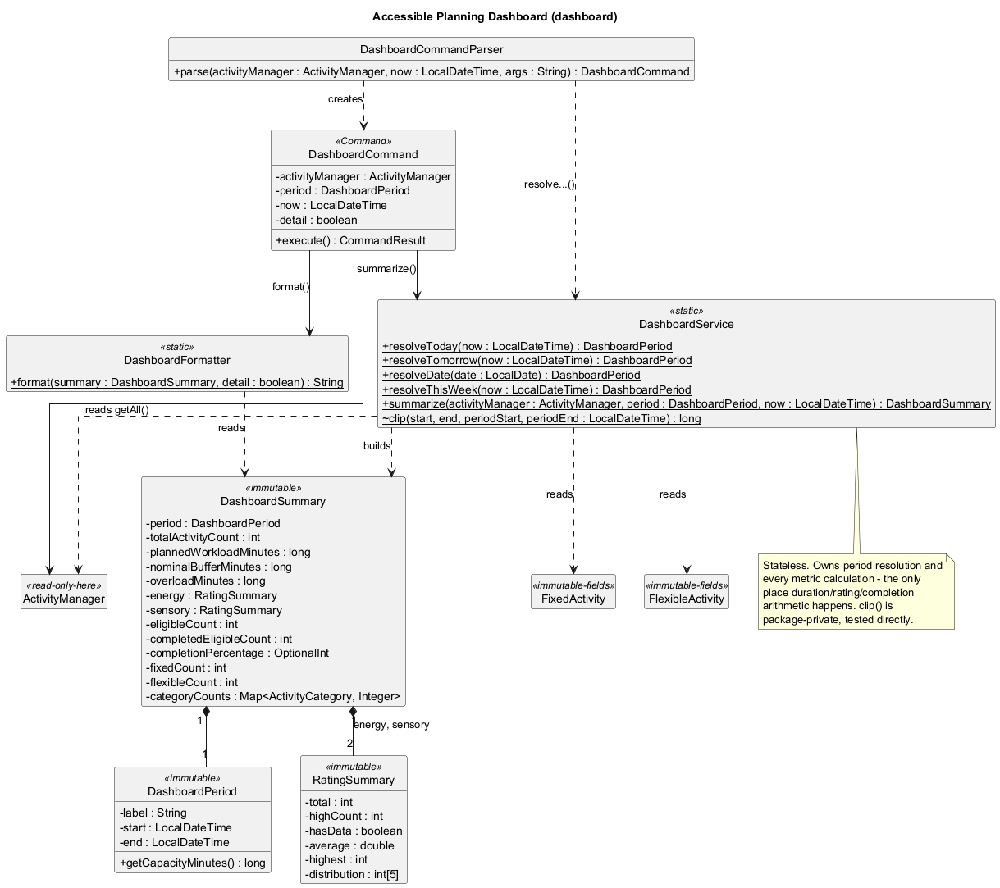</p>

Responsibilities are split the same way `route` splits parsing/policy/formatting:

- `parser.dashboard.DashboardCommandParser` - syntax only. Validates the grammar, resolves the
  selected period via `DashboardService`'s `resolve*` methods (using the `now` it was given, per
  the existing `list`/`next`/`edit` convention - `dashboard` never calls
  `LocalDate.now()`/`LocalDateTime.now()` directly in production code or tests), and captures the
  `detail` flag.
- `command.dashboard.DashboardCommand` - orchestration only: calls `DashboardService.summarize`,
  then `DashboardFormatter.format`. Implements neither `Confirmable` nor `MenuConfirmable` and
  inherits `ReadOnlyCommand`, so it never triggers a snapshot or save.
- `logic.dashboard.DashboardService` - stateless (all-static, mirroring
  `logic.route.AccessibleRouteGraphFactory`); owns period resolution and every metric calculation.
- `model.dashboard.DashboardPeriod`/`RatingSummary`/`DashboardSummary` - immutable calculated
  results. `RatingSummary` is reused identically for energy and sensory, since the two are
  structurally identical metrics (total, high-rating count, average, highest, 1-5 distribution)
  over different ratings, rather than duplicating six fields twice.
- `ui.dashboard.DashboardFormatter` - pure text formatting; makes no calculation of its own.

<p align="center">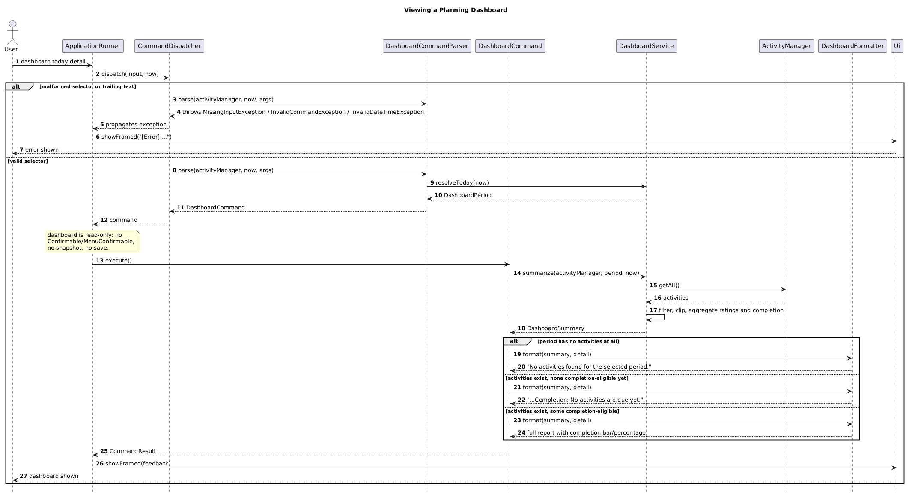</p>

**Period boundaries** are always half-open (`[start, end)`), computed with `java.time` so
month/year transitions and leap days are handled for free. `this week`/`next week` reuse `list this
week`'s exact Monday-Sunday boundary - not a rolling seven-day window - two now-superseded planning
drafts disagreed with each other and with `list`'s own shipped behaviour on this point; `list`'s
precedent is authoritative. The underlying `TemporalAdjusters.previousOrSame(MONDAY)` math itself
is centralised in `logic.RelativeDateResolver` (`today`/`tomorrow`/`mondayOfThisWeek`/
`mondayOfNextWeek`), not reimplemented per command: `list`, `find`, `dashboard`, `timetable`, and
`recommend` all resolve `today`/`tomorrow`/`this week`/`next week` through it, so the five commands
cannot silently drift apart on what those words mean. What each command's *parser* still owns
independently is the surrounding grammar - which selectors it accepts, where the phrase sits
relative to its own markers, and its own combination/trailing-text rules - since that genuinely
differs per command (e.g. `find`'s phrase sits before `k/`/`c/`/`topic/`/`date/`/`order/` markers
and has no `overdue`, unlike `list`).

**Activity inclusion** uses the same half-open intersection test for both activity types: a fixed
activity's `[start, end)` or a flexible activity's `[earliestStart, latestEnd)` must intersect the
period. **Planned-workload contribution** differs by type: a fixed activity's contribution is
*clipped* to the period (`clip(activityStart, activityEnd, periodStart, periodEnd)`, a
package-private `DashboardService` helper using `min`/`max` on the boundaries); a flexible
activity's contribution is its full requested `durationMinutes`, counted once, never clipped to
however much of its window overlaps the period - stated and tested as a limitation, not silently
invented data.

**Cross-midnight clipping - generic by construction, not reachable by real data today.** Both
`FixedActivity` and `FlexibleActivity` constrain start/end to one calendar date through explicit
constructor checks, so no activity in this codebase can actually span midnight.
`clip(...)` is nonetheless implemented generically over raw `LocalDateTime` boundaries with no
same-day assumption - exactly as correct for a hypothetical midnight-spanning interval as for an
ordinary one. `DashboardServiceTest` exercises this directly with synthetic
`LocalDateTime` pairs (a simulated Monday 23:00 -> Tuesday 01:00 interval clipped against a
Monday-only, a Tuesday-only, and a Monday-Sunday-week period, asserting 60/60/120-minute
contributions), rather than constructing an activity the model's own invariants would reject. No
cross-date activity support was added to `FixedActivity`/`FlexibleActivity`, their parsers,
storage format, or conflict-checking - that would be a v1.0 data-model change, outside this
feature's scope. See `docs/tasks/v2/dashboard/IMPLEMENTATION_NOTES.md` for the full account.

**Nominal capacity** is derived, not hardcoded per period "kind":
`Duration.between(period.start, period.end).toMinutes()` gives 1440 for any single day and 10080
for the week automatically. **Buffer/overload**:
`nominalBuffer = max(0, capacity - workload)`, `overload = max(0, workload - capacity)` - never
both non-zero. The metric is always labelled "Nominal buffer", documented everywhere as arithmetic
capacity minus planned workload, not a promise of actually-usable free time (overlapping fixed
activities count individually toward workload rather than merging, so a double-booked day reduces
nominal buffer accordingly without silently hiding the conflict).

**Energy/sensory**: totals are a plain sum of included activities' ratings; a rating counts as
"high" at a single named threshold, `DashboardService.HIGH_RATING_THRESHOLD = 4` (ratings 4-5).
Detail-mode averages use `BigDecimal`/`RoundingMode.HALF_UP` to one decimal place rather than raw
`double` formatting, so the documented rounding rule can't silently vary by platform or JDK
version; an empty rated set reports itself as having no data (`RatingSummary.hasData() == false`)
rather than a misleading `0`.

**Completion denominator**: an activity counts toward completion only once its own time has fully
passed - `!endTime.isAfter(now)` for fixed, `!latestEnd.isAfter(now)` for flexible - using the same
`now` the period itself was resolved against. A future or currently-in-progress activity is
excluded from both the completed and incomplete counts entirely, not folded into "incomplete".
Completion percentage is `Math.round(completed * 100.0 / eligible)`, computed once in
`DashboardService.summarize` and stored on `DashboardSummary`, matching every documented rounding
example (`2/3 -> 67%`) exactly.

**Deterministic ordering**: category-grouped counts iterate `ActivityCategory.values()` (fixed
enum declaration order), looking up each category's count from a `Map` rather than iterating the
map itself, so the result is independent of the map implementation's own iteration order. Rating
distributions are `int[5]` indexed by `rating - 1`, not a `Map<Integer,Integer>` - ascending order
is structural.

**Design alternatives considered:** a separate `DashboardDetail` model type (rejected - detail
metrics are cheap to always compute, so gating by a boolean at *format* time avoids a second
model's own emptiness story); six separate energy/sensory fields inline on `DashboardSummary`
(rejected in favour of the shared `RatingSummary`); exposing `clip(...)` as public API purely for
testability (rejected - it stays package-private, tested from a same-package test class, matching
`ActivityConflictChecker`'s precedent); raw `double` averages with `String.format` (rejected for
`BigDecimal`/`HALF_UP`, for exact, JVM-independent rounding).

Test strategy mirrors `route`'s: `DashboardServiceTest` (period resolution, the clipping
calculation directly, inclusion, workload, buffer/overload, ratings, completion eligibility and
percentage, detail-mode ordering - all synthetic fixtures, injected fixed clocks, no
`LocalDateTime.now()`), `DashboardCommandParserTest` (full accept/reject grammar),
`DashboardCommandTest` and `DashboardFormatterTest` (orchestration and exact-text formatting
respectively), and `DashboardIntegrationTest` (reads through the real `Storage`/`ActivityManager`
path, restart consistency, a malformed persisted line skipped safely, and a full
`ApplicationRunner` session proving no data file changes across several `dashboard` commands).
`text-ui-test` covers only `dashboard date/...` scenarios (deterministic regardless of wall-clock
date, using a far-future date so completion resolves to "not yet due" deterministically) -
`dashboard today`/`tomorrow`/`this week`/`next week` are excluded from `text-ui-test` for the same
reason `list today`/`tomorrow`/`this week`/`next week` already are (the harness runs the real jar
against the real wall clock, with no fixed-clock injection point), covered instead by
`DashboardServiceTest`'s injected-`now` tests.

## 14. Read-only timetable

`timetable today|tomorrow [detail]`, `timetable day/YYYY-MM-DD [detail]`,
`timetable week/YYYY-MM-DD [compact|detail]`, and `timetable this week|next week [compact|detail]`
build a deterministic view from `ActivityManager` without mutating or persisting anything. The
normal `list` command remains unchanged. `today`/`tomorrow` were added alongside the pre-existing
`day/`/`week/` markers and `this week` (rather than replacing them) to close a Defect-A gap:
`timetable` was the one date-aware command with no relative-keyword selectors at all, unlike its
`dashboard`/`recommend` siblings which already offered both a marker and relative keywords side by
side. `today`/`tomorrow`/`next week` resolve through the same `logic.RelativeDateResolver` every
other date-aware command uses (see Section 13).

<p align="center">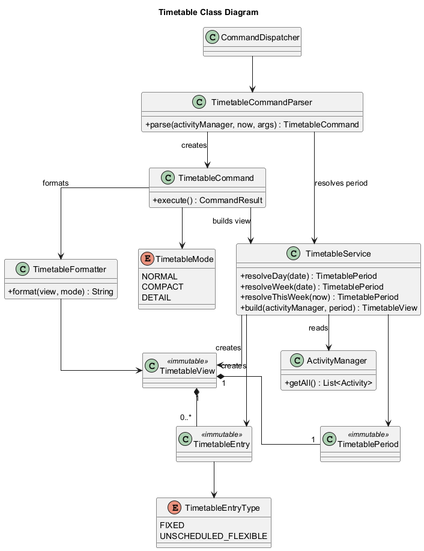</p>

Responsibilities follow the established command/parser/logic/model/formatter split:

- `parser.timetable.TimetableCommandParser` validates exactly one period selector and optional
  mode. It uses the existing strict `yyyy-MM-dd` parser and captures the injected `now` for
  `today`/`tomorrow`/`this week`/`next week`.
- `command.timetable.TimetableCommand` calls the service and formatter. It implements no
  confirmation interface and inherits `ReadOnlyCommand`, so execution does not
  take a mutation snapshot or save.
- `logic.timetable.TimetableService` resolves day and Monday-Sunday periods, selects activities,
  sorts them, detects fixed-activity overlaps, and creates immutable projections.
- `model.timetable.TimetablePeriod`, `TimetableEntry`, and `TimetableView` hold immutable calculated
  output. They deliberately do not retain mutable `Activity` references.
- `ui.timetable.TimetableFormatter` produces the normal, detail, and compact plain-text views.

<p align="center">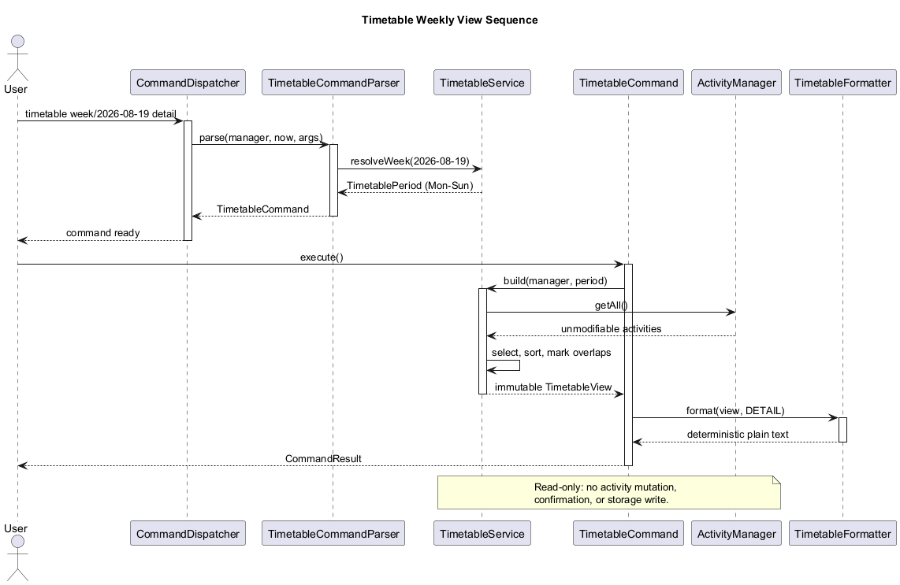</p>

**Ordering and overlap rules.** Fixed activities sort by date, start time, then permanent ID.
Flexible activities sort by date, earliest start, then permanent ID and remain in a separate
unscheduled section. Overlap detection uses same-day half-open intervals, so adjacent activities
do not overlap. Both members of every overlap pair are marked; identical starts never cause one
entry to replace another.

**Presentation decisions.** The historical `A1` display alias was rejected because activities
already have permanent numeric IDs. Stateful `timetable compact`/`timetable details` commands were
replaced by one-shot modifiers. An explicit `compact` modifier is the narrow-terminal fallback;
automatic width detection was rejected because Java 17 has no reliable portable terminal-width
API. A wide hour-cell grid was also rejected: arbitrary-minute boundaries, overlaps, and long
descriptions would require truncation or terminal assumptions. Day-grouped chronological sections
preserve every activity.

**Feature boundary.** No `[B]` buffer row is fabricated. Flexible activities now remain flexible
while optionally carrying one adopted scheduled placement, which timetable may render as `[R]`
after recommendation adoption. The same-day activity invariant remains unchanged, and route-aware
recommendation still remains out of scope while activities lack facility bindings.

Tests cover period boundaries, weekend inclusion, date/start/ID ordering, identical starts,
nested overlaps, adjacency, immutable projections, every parser rejection, exact formatter text,
restart consistency, zero file mutation, dispatcher and guide wiring, and Text-UI scenarios. The
wall-clock-relative `this week` path is tested with injected time rather than the Text-UI harness.

## 15. Global planning preferences

`preference view`, `preference set`, and `preference reset` manage one global profile for the
deterministic recommender. `PreferenceProfile` is an immutable validated value containing
a preferred daily start/end, a minimum buffer in minutes, and an advisory Tomato/Pomodoro
suggestion flag. `PreferenceProfile.defaults()` is the single production source for the
backward-compatible defaults: `08:00`, `20:00`, `15`, and `OFF`.

<p align="center">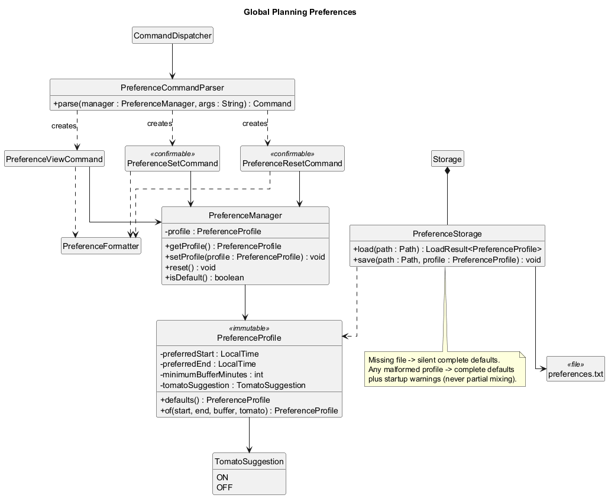</p>

`PreferenceCommandParser` uses declared markers and rejects unknown, empty, trailing, and
duplicate fields. For a partial set, it combines supplied values with unchanged current values,
then constructs one complete `PreferenceProfile`; start-before-end and buffer-range validation
therefore occurs before confirmation and cannot partially update the manager. Marker order has no
meaning. A set/reset preview is side-effect-free, and cancellation never reaches execution or
storage.

<p align="center">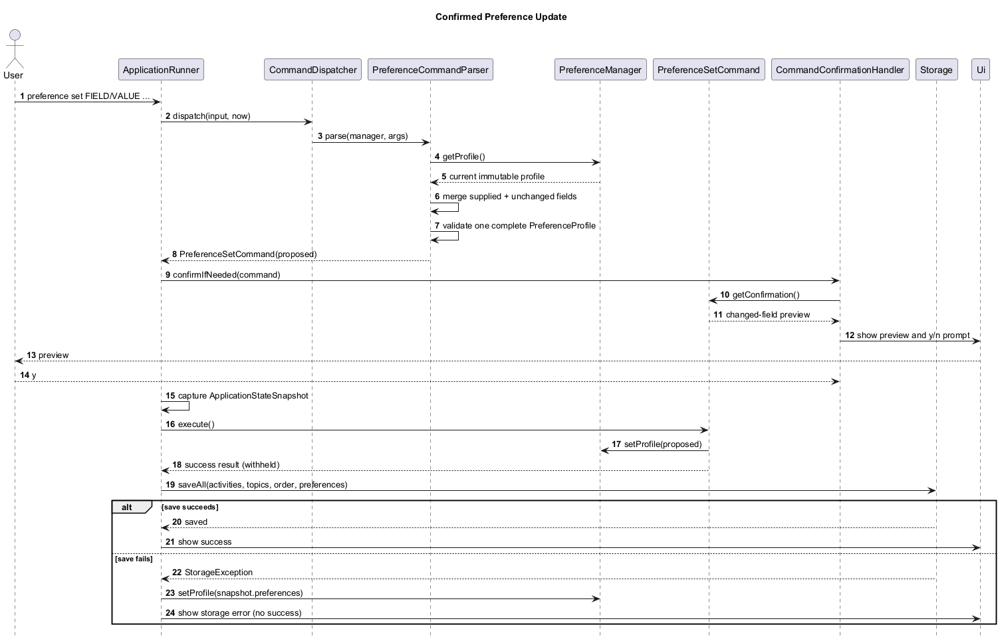</p>

`PreferenceStorage` uses a deterministic four-line `KEY|VALUE` format. Loading is deliberately
all-or-default: a missing file silently returns the complete default profile, while a malformed,
incomplete, duplicate, unknown, invalid, or internally inconsistent profile returns all defaults
with concise startup warnings. Valid fields from a broken profile are never mixed with defaults.

Preferences participate in the four-file `Storage.saveAll` transaction and in the
`CommandTransactionExecutor` snapshot, so a persistence failure restores both disk state and the
prior in-memory profile before any success feedback. `reset all` option 1 restores profile defaults;
option 2 retains the profile while keeping class schedules; option 3 cancels without change.

Tomato/Pomodoro is still data only in this feature itself. `preference` does not create previews
or mutate activities; it only stores one advisory flag that `recommend` later reads when deciding
whether to print study-oriented Tomato suggestions. It does not change Dashboard calculations,
timetable rendering, route feasibility, or energy/sensory interpretation.

## 16. Deterministic schedule recommendation

`recommend`, `recommend this week`, `recommend next week`, `recommend today`, `recommend tomorrow`,
`recommend date/YYYY-MM-DD`, `recommend view`, `recommend adopt`, and `recommend cancel` form one
in-memory preview-and-adopt workflow. Bare `recommend` is an alias for `recommend this week`;
`recommend today`/`recommend tomorrow` are parser-level sugar for `recommend date/<today>`/
`recommend date/<tomorrow>` (no separate service method - they resolve through the same
`RecommendationService.recommendDate`). Generation and `view` are read-only; `cancel` mutates only
the in-memory proposal store; `adopt` is the only recommend command that mutates persisted activity
state.

<p align="center">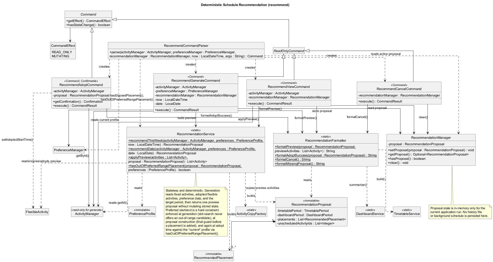</p>

`RecommendCommandParser` returns one of four command types: generate, view, cancel, or adopt.
`RecommendationManager` holds at most one active `RecommendationProposal` for the current
application run only; no recommendation history file is introduced. `RecommendationService` is
stateless and deterministic: it reads current activities, global preferences, and the requested
period, then returns one immutable proposal containing ordered `RecommendedPlacement`s and any
unscheduled flexible activity IDs.

**Preview responsibility: logic calculates, UI only formats.** `RecommendationService.buildPreview`
(not `RecommendationFormatter`) builds the preview: it applies the proposal's placements to copied
activities (never in-place mutation), then calls `TimetableService.build`/`DashboardService.summarize`
to produce the preview `TimetableView`/`DashboardSummary`, bundled with the proposal into one
immutable `RecommendationPreview`. Both `RecommendGenerateCommand` and `RecommendViewCommand` call
`buildPreview` with the actual injected `now` and hand the resulting `RecommendationPreview` straight
to `RecommendationFormatter.formatPreview`, which does no calculation of its own - matching this
guide's UI-formats/logic-calculates layering. This replaced an earlier design where
`RecommendationFormatter` called `DashboardService`/`TimetableService` directly and, critically, used
the selected period's own `start` (midnight) as the dashboard's completion-eligibility basis instead
of the real `now` - `recommend today`'s preview dashboard could disagree with an equivalent plain
`dashboard today` about which activities were already due. `now` flowing through
`RecommendationService.buildPreview` fixes both the layering and the defect at once.

**Generating, viewing, and cancelling a proposal.** `recommend`/`recommend view`/`recommend
cancel` all deal only with the in-memory `RecommendationManager` proposal store - none of them
snapshot, save, or otherwise touch persisted activity state. `RecommendAdoptCommand` and `Storage`
never appear in this part of the flow at all.

<p align="center">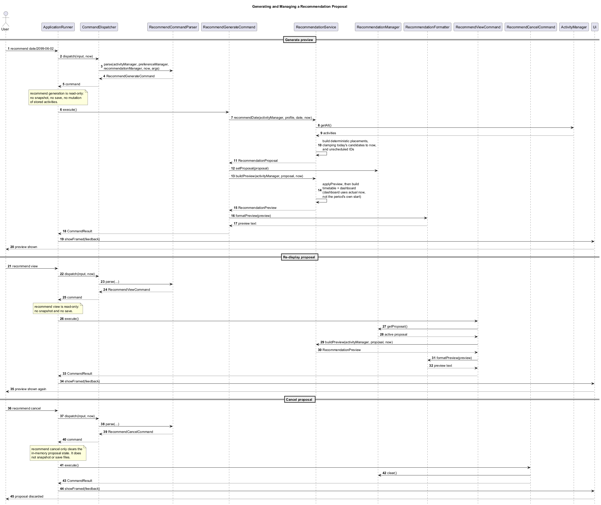</p>

`RecommendationService` treats every fixed activity and every already-adopted flexible activity as
an existing commitment. Eligible work is restricted to incomplete, not-yet-adopted flexible
activities whose date lies inside the target day/week period. For each eligible activity, every
valid start minute is enumerated inside the **intersection** of the activity's own
earliest/latest window and the preference profile's preferred daily start/end
(`RecommendationService.effectiveEarliestStart`/`effectiveLatestEnd`), subject to the configured
minimum buffer on both sides of neighbouring commitments **and clamped to never be before `now`**:
on today's date, the earliest candidate start is `max(activity.earliestStart,
preferences.preferredStart, now rounded up to the next whole minute)`; on a date strictly before
`now`'s date, the activity has no valid slots at all (it surfaces as unscheduled, never as a
past-dated placement); on a future date, the window is unrestricted by `now` (though still bounded
by the preferred range). If the intersection is empty, or narrower than the activity's own
duration, the activity is left unscheduled rather than risking a wrapped-past-midnight `LocalTime`
range from a naive `latestEnd.minusMinutes(duration)` on an unvalidated interval.

Preferred start/end used to be scored only as a low-priority tie-break penalty
(`preferredRangePenalty`), which a PE-style review correctly flagged as ineffective: a flexible
activity's window could still be proposed well outside preferred hours whenever an in-range slot
existed, because nothing ever excluded the out-of-range candidate from `validSlots` in the first
place. Making the preferred range a hard pre-filter (this section's first paragraph) fixed that.
`preferredRangePenalty` no longer exists in the current source at all: the whole-day-optimization
rewrite described below (**Whole-day optimization**) later removed it, along with the rest of the
old per-slot `SlotScore` scoring apparatus it belonged to, once the hard pre-filter had already made
every such penalty permanently a no-op. `RecommendationServiceTest`'s
`recommendDate_windowStartsBeforePreferredStart...`, `..._windowEntirelyAfterPreferredEnd...`,
`..._narrowerPreferredWindow...`, `..._todayNowLaterThanPreferredStart...`, and
`..._preferredWindowNarrowerThanDuration...` cases cover the hard pre-filter directly.

Separately, this closed a regression where a today-dated flexible activity's window that had
already fully or partly elapsed by the time `recommend` ran could still be proposed at its original,
already-past earliest time - see `RecommendationServiceTest`'s `recommendDate_wholeWindowElapsed...`
and `..._partiallyElapsedWindow...` cases, and `PE_REGRESSION_DEBUG_PLAN.md`'s "Critical recommender
regression" batch, which this fix directly answers.

**Whole-day optimization.** Placement used to be a purely greedy, activity-by-activity search: on
each iteration, whichever remaining activity had the fewest valid slots claimed its own
earliest-fitting slot, independently of every other activity still waiting to be placed. A
PE-style review confirmed this is an observable functionality defect, not just a theoretical one:
a short activity could grab a slot that was the *only* way a longer activity later the same day
could have fit, so `recommend` reported an activity as unscheduled even when a valid whole-day
schedule containing it existed.

`RecommendationService` now groups each period's eligible flexible activities by date and searches
each date independently (dates never interact, since every buffer/overlap check in `fits` is
already scoped to a single date). For up to `PERMUTATION_CAP` (7) remaining activities on a date -
comfortably more than a real day's flexible workload - it exhaustively tries every ordering and,
for each ordering, places its activities in that exact sequence at each one's own earliest feasible
slot given the activities already placed earlier in the same ordering. This is provably at least as
good as any other placement of that ordering's activities: placing each one as early as possible can
only free up room for the activities considered afterwards, never take room away, so trying every
ordering explores every combination of which activities end up schedulable together. Beyond the
cap, `heuristicOrderings` substitutes a small, fixed set of orderings (tightest window first,
longest duration first, earliest own-window first, stable ID order) to keep the search bounded,
trading a guaranteed-optimal result for implausibly large single days.

**Performance hardening: no more factorial memory/time spike at the cap boundary.** An independent
QA benchmark found an abnormal cliff at exactly `PERMUTATION_CAP` remaining activities: ~34 ms at 5,
~342 ms at 7, then ~3.2 s at 8 (40,320 = 8! orderings, each fully re-evaluated from scratch and every
ordering first materialized into a `List<List<FlexibleActivity>>`), dropping back to ~5 ms at 9 once
`heuristicOrderings` took over - the exhaustive path was both allocating memory proportional to
`n!` and never sharing work between orderings that share a prefix. `exhaustiveSearch`/
`searchOrderings` replaced the old materialize-then-evaluate `permute`/`placeInOrder` pair with
in-place swap backtracking (the same permutation-generation algorithm as before) fused directly with
greedy placement: each recursive call places exactly one activity using the commitments already
built up by its ancestors, so no ordering is ever materialized as a full list, and a branch is
pruned outright once `placedSoFar.size() + remainingDepth` can no longer reach the best item count
already found (`DaySchedule.betterThan`'s top-priority criterion) - a safe bound, since an
ordering's final item count can never exceed already-placed items plus however many candidates
remain. `PERMUTATION_CAP` was also lowered from 8 to 7 (5,040 worst-case orderings, consistently
well under a second even when the item-count pruning above never triggers, e.g. every candidate
activity fits so no branch is ever prunable) after benchmarking confirmed pruning alone does not
bound the true adversarial case (all activities mutually compatible, maximal branching). Re-measured
on the same machine, before/after the algorithmic change, with `PERMUTATION_CAP` still at 8 to
isolate the incremental-generation effect: n=8 was ~2.7 s unfixed vs. ~2.65 s fixed-but-unpruned
-benefiting little from pruning alone under this adversarial all-fit workload, which is exactly why
the cap was also lowered. With the cap at 7 (the shipped configuration): n=7 (still exhaustive)
~316 ms, n=8 (now heuristic) ~7 ms - no more cliff. Scheduling output is unchanged for every
`n <= PERMUTATION_CAP` case: the set of orderings explored is identical to the old `permute`
output, evaluated via the identical greedy `earliestValidSlot` logic, so `DaySchedule.betterThan`
selects the same winner. `RecommendationServiceTest`'s `recommend_eightFlexibleActivities_
returnsDeterministically`, `recommend_largeFlexibleSet_doesNotMaterializeAllPermutations`, and
`recommend_optimization_preservesExpectedSchedule` cover determinism, the bounded-time guarantee (a
generous CI-safe threshold, not a brittle near-actual-runtime one), and placement correctness
respectively.

Every resulting `DaySchedule` (which activities were placed, and when) is compared via
`DaySchedule.betterThan` using the fix's priority order: (1) more scheduled activities beats fewer,
(2) given a tie, more total scheduled duration wins, (3) given a further tie, a lower total
intrinsic slack among the scheduled activities wins (an activity's slack is how much wider its own
window is than its duration - preferring tighter-window activities when there is a genuine choice
of *which* activities to schedule), (4) given a further tie, an earlier aggregate placement wins,
and (5) the lower sorted list of scheduled activity IDs is the final, fully deterministic
tie-break. `RecommendationServiceTest`'s `recommendDate_threeActivitiesFitTogether...`,
`..._restrictiveProfileFourActivitiesFitTogether...`, and
`..._restrictiveProfileTwoActivitiesFitTogether...` cases reproduce the review's reported scenarios
directly and assert every activity in them is now scheduled.

This search replaces `chooseNextActivity`/`chooseBestSlot` and the buffer-slack/energy-spread/
sensory-spread/preference-penalty scoring fields entirely (previously recorded as known technical
debt in this section, since those fields were live only in the rare case of two different
activities' already-chosen best slots coincidentally sharing a clock time) - superseded rather than
patched, since the greedy one-activity-at-a-time design those fields were built around is exactly
what this section's fix removes. Tomato never changes slot selection; it only controls whether
certain study-like placements print an advisory suggestion line in the preview.

**Boundary-enforcement pipeline (defense-in-depth).** Preferred start/end are a hard constraint,
never a soft one, and this is enforced at every stage a candidate time passes through, not solely
inside slot generation:

1. **Slot generation** - `earliestValidSlot`'s search loop never even considers a candidate minute
   before `effectiveEarliestStart` or after `effectiveLatestEnd`, so every value it can return is
   already inside `[preferredStart, preferredEnd]` by construction.
2. **Slot selection** - `DaySchedule.betterThan` (the whole-day search's ranking, described above)
   only ever compares and ranks among the candidates stage 1 already produced; it has no path to
   introduce a time stage 1 didn't offer, so ranking can narrow the choice but never widen it back
   outside the boundary.
3. **Final proposal construction** - `RecommendationService.withinPreferredRange` is re-checked in
   `build` immediately before each `ScheduledItem` becomes a `RecommendedPlacement`; anything that
   somehow fails it is discarded from the proposal and reported unscheduled instead, rather than
   ever reaching the caller. In normal operation this can never trigger, since stage 1 already
   guarantees it - it exists so that a future change to slot generation cannot silently reintroduce
   an out-of-range placement without also being caught here.
4. **Adoption** - see "Stale-proposal rejection" below: `recommend adopt` re-validates every
   placement against the *current* preference profile (not the one active when the proposal was
   generated), since `preference set`/`preference reset` can run at any time between `recommend`
   and `recommend adopt`.

`RecommendationService.hasOutOfPreferredRangePlacement` is the reusable check backing stages 3 and
4; `RecommendationServiceTest`'s `recommendDate_earlyWindowClampsToPreferredStart...`,
`recommendThisWeek_everyPlacementStaysWithinPreferredRange...`,
`recommendNextWeek_everyPlacementStaysWithinPreferredRange...`,
`recommendDate_todayClampAndPreferredEndBothApply...`, and the `hasOutOfPreferredRangePlacement_*`
cases cover this directly, alongside `RecommendCommandParserTest`'s
`parse_adopt_rejects/acceptsProposalThat...AfterPreferenceChange` cases for stage 4.

**Stale-proposal rejection.** A proposal is generated once and can sit unadopted while the user
keeps working; by the time `recommend adopt` is entered, real time may have advanced past one or
more of its proposed starts. `RecommendCommandParser` checks
`RecommendationService.hasElapsedPlacement(proposal, now)` before constructing
`RecommendAdoptCommand` at all - stale adoption is rejected with a specific message *before* the
confirmation prompt, never as a partial or silently-backdated adoption. "Stale" means strictly
`now.isAfter(placementDate.atTime(placementStart))`; a placement whose start is exactly `now` is
still adoptable. Immediately after this check, the parser also rejects adoption if
`RecommendationService.hasOutOfPreferredRangePlacement(proposal, preferenceManager.getProfile())` is
true - see the boundary-enforcement pipeline above.

**Validating and adopting a proposal.** Unlike generate/view/cancel above, `recommend adopt` is
the one recommend command that validates, confirms, mutates, persists, and can roll back - the
stale-proposal and boundary-guard checks above run first, then adoption itself proceeds as a
normal `CommandTransactionExecutor`-managed mutating command.

<p align="center">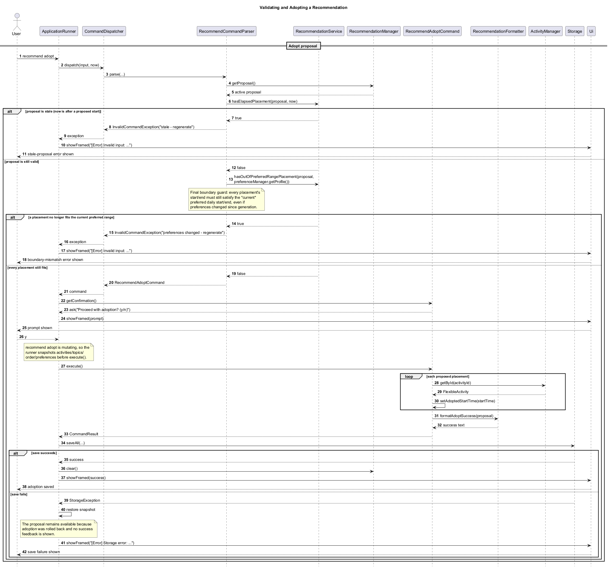</p>

Adoption is handled as a normal mutating command through `ApplicationRunner`. Because the
stale-proposal check above only ran once, at dispatch time, before the confirmation prompt was
even shown, `RecommendAdoptCommand` also implements `PreExecutionValidatable`:
`ApplicationRunner` calls `validateBeforeExecution(now)` with a freshly-sampled `now` immediately
after the user answers "y" and immediately before execution, re-running
`RecommendationService.hasElapsedPlacement` - a placement that elapsed while the user was still
answering the prompt is rejected here instead of silently being adopted. Only after that fresh
check passes does `CommandTransactionExecutor` snapshot activities/topics/order/preferences. The
command first resolves and validates every placement against current activity state (building an
`AdoptionTarget` per placement), then writes adopted start times only after the whole proposal
passes - two distinct loops, not one interleaved validate-then-mutate pass, so a bad later
placement can never leave earlier ones partially adopted. The runner persists the normal four
user-state files through `Storage.saveAll`. Any execution or save failure restores the full
pre-adoption snapshot and reports the error instead of showing a false success. On save success,
the active in-memory proposal is cleared; on failure, it remains available because adoption never
committed.

**Proposal lifecycle vs. other mutating commands.** `ApplicationRunner.processCommand` clears
`RecommendationManager`'s stored proposal after every *other* successful mutating command too
(`add`, `edit`, `delete`, `mark`, `unmark`, `order set`, `recur`, `reset all`, every `topic`
mutation, and `recommend adopt`'s own success above) - `isPreferenceMutation(command)` is checked
first and is the one deliberate exception: `preference set`/`preference reset` succeeding does
*not* clear the proposal, since preference changes have their own documented contract (Section 15,
`guide preference`) that an existing proposal survives a preference change and is re-validated
against the *current* profile only at adopt time (stage 4 of the boundary-enforcement pipeline
above) - not discarded out from under the user the moment they adjust a preference. This is a
narrow, explicit exception; every other mutating command still invalidates an active proposal on
success, on the working assumption that any other state change could have altered what a sensible
recommendation looks like, which this fix does not attempt to re-litigate per command.

Route-aware recommendation remains deliberately out of scope here. Activities still do not carry
approved facility/location bindings, so recommendation cannot incorporate campus travel time or
accessibility graph constraints without expanding the v1.0/v2.0 activity model beyond what this
branch approved.

## 17. Logging and assertions

`LoggingConfig` removes default console handlers and attaches one append-mode `FileHandler` at
`data/unienable.log`. It records `INFO` and above with `SimpleFormatter`; operational logs do not
pollute the text UI. If file logging cannot be initialised, startup continues with application
logging disabled. Shutdown detaches and closes the handler.

Activity and topic mutations log at `INFO`. The runner logs startup/load warnings and save failures
at `WARNING`, and unexpected runtime failures at `SEVERE`. A storage rollback failure is also
`SEVERE` because the persisted state may need manual inspection.

Java assertions protect programmer-only lifecycle assumptions such as
`ApplicationRunner.processCommand` requiring its collaborators to be initialised. Domain model
invariants use explicit checks, while parsers and storage validate untrusted input and raise
checked domain exceptions or load warnings. Required behaviour therefore does not depend on
whether `-ea` is enabled.

## 18. Design considerations

### Extracting conflict validation

**Alternative 1: keep conflict validation in `ActivityManager`.** This keeps fewer classes and
avoids one delegation, but combines collection ownership, IDs, queries, sorting, mutation, and
scheduling policy in a growing manager. Focused policy tests must then construct the broader
manager state.

**Alternative 2: extract `ActivityConflictChecker`.** This introduces a small collaborator while
keeping it package-private and stateless. The checker has one cohesive responsibility, and the
manager remains the only public mutation boundary.

**Chosen: Alternative 2.** Extraction improves single-responsibility separation and cohesion,
reduces the manager's policy burden, and enables focused checker tests. Coupling stays narrow
because only `ActivityManager` owns the checker; parsers and recurrence still call the manager
facade. Existing duplicate precedence, overlap selection, messages, and manager behaviour are
preserved.

### Intentional predicate duplication

Similar scheduling predicates exist at three boundaries: logic checks general mutations,
recurrence identifies an already-generated occurrence before general preflight, and storage
validates untrusted records independently. This creates a maintenance risk: a future rule change
may require coordinated updates and boundary-specific tests. Consolidation was intentionally
outside this refactor because recurrence's identical-occurrence skip has different semantics and
storage must not depend on logic. A later change should first define one boundary-neutral policy
contract and preserve each caller's distinct error and recovery behaviour.

The same trade-off applies to the effective-occupied-interval concept itself (Section 7): both
`logic.ActivityConflictChecker` and `storage.ActivityStorage` now independently define "a fixed
activity always occupies time; a flexible activity only does once adopted" via their own private
`ScheduledInterval`-shaped helper, for the same storage-must-not-depend-on-logic reason. A third,
older, differently-shaped version of the same idea already existed before this pair - `logic
.ActivityManager`'s private `scheduledStart`/`scheduledEnd` (next-activity selection) and
`logic.timetable.TimetableService`'s private `ScheduledEntrySource` (the `[OVERLAP]` timetable
marker) - neither of which was consolidated into the new helper, since both serve a different
concern (display/selection, not mutation validation) and touching them was outside this fix's
scope.

### Other decisions

- Academic weeks are resolved from explicit calendar ranges so recess and other gaps do not break
  recurrence dates.
- Accessibility records remain separate from activities; activities do not store route state.
- `reset all` and recurrence use the same class-schedule eligibility policy.
- `parser.common.ArgumentTokenizer`/`ArgumentMarker` provide declared-marker parsing and
  duplicate-marker rejection for `preference set`. `logic.graph.AccessibilityGraph`, the other
  preparatory utility from the same hardening session, is no longer unused - v2.0's `route` is its
  first real caller, via
  `logic.route.AccessibleRouteGraphFactory` (Section 12).
- `add`/`edit`, and (as of the second-pass QA audit below) `find`, `list`, `route`,
  `connection find`, `facility find`, and every `topic` subcommand, all reject a repeated declared
  field prefix (e.g. `n/A n/B`, `from/A from/B to/C`), through `FieldParser.rejectDuplicateMarkers`
  rather than by migrating them onto `ArgumentTokenizer`.
  `ArgumentTokenizer` additionally rejects any *undeclared* marker-shaped token
  (`[A-Za-z][A-Za-z0-9]*/`) found unquoted in the text, which would force free-text description/
  note values containing an incidental `word/` (e.g. `n/Meeting w/ friends`) to be quoted -
  acceptable for `preference set`'s small fixed-value fields, but a materially larger behavioural
  change than this fix calls for on any parser's free-text fields.
  `FieldParser.rejectDuplicateMarkers` only scans for the command's own declared markers occurring
  twice, leaving undeclared free text untouched, and reuses `ArgumentTokenizer`'s
  `Duplicate option "..."` wording for consistency. `dashboard`/`timetable`/`recommend` are
  whole-word-token parsers (not marker-extraction based) that already reject a second `date/`/
  `day/` token via their own "unexpected text after the period" checks, just with different
  wording - left as-is, since they were never silently mis-parsing, only phrased differently.
  **`find`'s `k/` is the one deliberate exception to this rule (DEFECT-02, regression report,
  2026-08-16):** the second-pass QA audit above had `k/Study k/Assignment` reject as a duplicate,
  same as every other marker, but that contradicted `find`'s own documented grammar ("multiple
  keywords ... use AND") and broke the exact multi-keyword search it describes. `k/` is now
  extracted via the new `FieldParser.extractAllOccurrences` (every occurrence collected and
  AND-combined, each still capped at one-or-two words), while `c/`/`topic/`/`date/`/`order/`
  keep going through the unmodified `rejectDuplicateMarkers`/`extractPresentFields` pair over the
  `k/`-stripped remainder - so `k/` is the only find marker that may repeat.
- `ActivityManager.sort()`'s `ActivityOrder.TIME` case used to compare only time-of-day
  (`getSortTime()`, no date term at all), so two activities sharing a start time on different
  dates fell through to an ID tie-break instead of the earlier date sorting first - a real
  ordering defect independently confirmed for both `list order/time` and `find order/time` (they
  have always shared this one `sort()` method; it was never a `find`-specific inconsistency, just
  first noticed via `find`, since no existing `list order/time` usage happened to span multiple
  dates with a repeated time). Fixed by having `TIME` share `CHRONOLOGICAL`'s exact
  date-then-time-then-id comparator rather than maintaining a second, subtly different one - both
  marker strings (`order/time`/`order/chronological`) remain independently valid input and resolve
  to the identical ordering.
- `parser.common.DateTimeParser` and `storage.ActivityStorage` (plus `storage.preference
  .PreferenceStorage`) each define their own strict `uuuu-MM-dd`/`HH:mm` `DateTimeFormatter`
  constants and shape-then-strict-parse logic, which look like duplication worth extracting into
  one shared codec. `ActivityStorage` already carries a comment explaining why this is
  intentional: a persistence codec must keep reading the exact bytes it already wrote regardless
  of how the CLI parser's input rules evolve, so coupling storage's wire format to
  `parser.common` would risk a future parser-ergonomics change (e.g. relaxing what `add`/`edit`
  accept) silently breaking storage's ability to reload files it saved under the old rules. Since
  the two are already correctly decoupled (storage carries no "not before today"/"not before now"
  policy, and neither package imports the other), the remaining duplication is confined to format
  constants and shape/strict-parse mechanics - real, but low-severity, and extracting it would
  reintroduce exactly the coupling the existing comment was written to avoid. Left as-is; revisit
  only if the two formats are ever deliberately required to diverge or converge further.

### Maintainability review (2026-08 codebase audit)

`GuideCommand`, `RecommendationService`, `DashboardService`, `ActivityCommandParser`,
`ActivityStorage`, and `ApplicationRunner` were each reviewed for whether their size reflects
genuinely mixed responsibilities or just legitimate, cohesive content. None were changed:
`GuideCommand` is ~35 lines of command logic plus a large but simple static help-text lookup
table; `DashboardService` and `RecommendationService` are each one cohesive computation pipeline
whose length tracks real algorithmic/metric complexity; `ActivityCommandParser` is already a thin
router produced by earlier decomposition; `ActivityStorage`'s length tracks its two persisted
record shapes' field counts; `ApplicationRunner` was already slimmed by extracting
`CommandTransactionExecutor` (Section 10). Two extractions were identified as justified by the
same reasoning that motivated `ActivityConflictChecker` (Section 18's first subsection) but were
deferred as out of scope for this correctness-focused audit pass, since neither is a defect:
`ActivityManager`'s "next relevant activity" selector (`next`/`findScheduledInProgress`/
`findNearestUpcomingScheduled`/`findSoonestEndingFlexible`, ~150 lines) is a self-contained,
stateless computation over `(activities, now)` that could become its own `NextActivityFinder`
collaborator; and `Storage`'s ~150-line generic atomic multi-file commit/rollback engine
(`tempSiblingOf`/`backupIfExists`/`commit`/`restore`/`commitAllWithRollback`) has zero knowledge of
activities/topics and is independently testable with arbitrary temp files, and could become its
own `AtomicFileTransaction` collaborator.

## 19. Testing

The automated strategy has four layers:

- unit tests for parsers, models, managers, the conflict checker, recurrence, and storage;
- integration tests for `ApplicationRunner`, confirmations, persistence, and rollback;
- the Gradle `check` lifecycle for JUnit and Checkstyle;
- the Git Bash text-UI regression for end-to-end command/output compatibility.

`UniEnableTest` drives `UniEnable.run` end to end through a scripted input stream. It always
supplies the 3-arg overload with a fixed `TEST_NOW` (strictly before every hardcoded activity date
literal used in the file), never the 2-arg overload that defaults to the real wall clock - the
same injected-`now` seam used throughout `ApplicationRunner`/`DashboardService`/
`RecommendationService` testing (Sections 13-16), so the suite's pass/fail never depends on when
it happens to run.

Conflict tests should cover both activity types, ignored metadata, completed activities,
duplicate-before-overlap precedence, adjacency, permanent-ID exclusion, and first-overlap order.
Recurrence tests should cover source-week inclusion, no-class and identical skips, planning
preflight, final batch revalidation, candidate-to-candidate validation, IDs, and no partial
mutation. Storage tests should independently exercise malformed records and four-file commit
rollback. Runner tests should force save failures for each category of mutation. Preference tests
cover exact defaults, immutable complete-profile validation, independent and reordered
multi-field updates, invalid markers/values, cancellation and no-op behaviour, all-or-default
storage recovery, deterministic round-trip, restart persistence, read-only no-write behaviour,
reset options, and save-failure rollback. Route tests
should cover Dijkstra correctness (direct vs. multi-edge, distance-optimal vs. hop-optimal),
`YES`-only edge exclusion, disconnected pairs, the same-facility zero-length case, unknown
facilities, and malformed/duplicate/negative-distance reference data - all against small
synthetic fixtures (`docs/tasks/v2/route/TEST_PLAN.md`), never the real bundled dataset, so
algorithmic edge cases stay independent of what the shipped `facilities.txt`/`connections.txt`
happen to contain. Dashboard tests should cover period-boundary math (day/week, month/year/leap
transitions), interval inclusion and clipping (including the cross-midnight calculation via
synthetic `LocalDateTime` boundaries - see Section 13), workload/buffer/overload arithmetic,
completion eligibility and percentage rounding under an injected clock, and detail-mode
deterministic ordering - all in `docs/tasks/v2/dashboard/TEST_PLAN.md`, with `text-ui-test`
restricted to `dashboard date/...` scenarios for the same real-wall-clock-determinism reason
`list today`/`tomorrow`/`this week` are.

## 20. Product scope

UniEnable serves tertiary students with ASD or ADHD and tertiary students who use wheelchairs as
they prepare for unfamiliar university, internship, or entry-level work routines. It prioritises
predictable keyboard interaction, concise output, local data ownership, energy/sensory planning,
and explicit uncertainty in accessibility information.

Implemented v1.0 scope includes activity and topic management, completion and ordering, next-item
selection, academic-calendar recurrence, reset choices, read-only facility/connection lookup, and
reference-file validation. v2.0 has added accessible route search (`route`, Section 12), the
accessible planning dashboard (`dashboard`, Section 13), the read-only timetable (`timetable`,
Section 14), global planning preferences (`preference`, Section 15), and deterministic schedule
recommendation (`recommend`).

## 21. User stories

| Priority | As a ... | I want to ... | So that ... |
|---|---|---|---|
| Must | student managing an unfamiliar routine | record fixed and flexible activities | I can plan confirmed and movable work. |
| Must | student sensitive to workload and environment | record energy and sensory ratings | I can anticipate an activity's demands. |
| Must | student | see one next relevant activity | I need not scan a dense itinerary. |
| Must | wheelchair user | inspect local facility and connection information | I can prepare for known barriers. |
| Should | student with weekly classes | generate semester occurrences from a supplied calendar | I avoid repetitive entry while retaining independent activities. |
| Should | student starting a new period | reset all data or retain class schedules | I can clear obsolete planning state safely. |
| Should | wheelchair user | find the shortest confirmed-accessible route between two facilities | I do not have to guess whether a shorter-looking path is actually usable. |
| Should | student sensitive to workload and environment | see a summary of how full a day or week is | I can gauge my planning load without manually adding it up myself. |
| Should | student planning a week | view fixed and unscheduled activities by day | I can scan my commitments without assigning invented times. |
| Should | student planning around personal limits | save one daily range, buffer, and advisory Tomato preference | I can reuse consistent planning inputs without re-entering them. |

## 22. Use cases

### UC01: Add an activity

**Main success scenario:** The user enters a valid `add` command. UniEnable validates the fields,
checks conflicts, adds the activity, saves all planning state, and reports the new permanent ID.

**Extensions:** Invalid fields or conflicts are reported without mutation. If saving fails, the
addition is restored to the prior state and no success message is shown.

### UC02: Edit an activity

**Main success scenario:** The user supplies one or more changes. UniEnable builds and preflights a
replacement, shows the actual differences, receives `y`, revalidates, replaces, saves, and reports
success.

**Extensions:** No effective change ends without confirmation. Invalid input or a conflict ends
before confirmation. `n` cancels. A save failure restores the original activity.

### UC03: Create recurring class sessions

**Main success scenario:** The user selects an eligible source and weeks including its source
week. UniEnable plans dates, shows planned/skipped occurrences, receives `y`, atomically inserts the
batch, saves, and reports success.

**Extensions:** Ineligible sources, calendar errors, missing source week, or conflicts reject the
request without mutation. No new occurrences skips confirmation. `n` cancels. Final revalidation or
saving failure leaves no partial batch.

### UC04: Consult accessibility data

The user lists, views, finds, or validates facilities/connections. UniEnable returns local
reference data plus its disclaimer and never modifies the dataset.

### UC05: Find an accessible route

**Main success scenario:** The user supplies two known facility names. UniEnable computes the
shortest path using only confirmed-accessible connections and reports the ordered chain, each
segment's detail, and the total distance.

**Extensions:** The same facility for both ends succeeds with a zero-length result. An
unrecognised facility name is rejected before any pathing occurs. Two known facilities with no
confirmed-accessible path between them get an explicit no-route message rather than a suggested,
unconfirmed route.

### UC06: View a planning dashboard

**Main success scenario:** The user selects a period (today, tomorrow, a date, or this week).
UniEnable calculates planned workload, nominal buffer, energy/sensory totals and high-rating
counts, and completion, from currently stored activities only, and displays the summary.

**Extensions:** An empty period shows a distinct "no activities found" message. A period with
activities but none yet due shows "no activities are due yet" instead of a percentage.
`detail` additionally shows fixed/flexible counts, a category breakdown, and full rating
distributions. Every parser rejection (missing/invalid selector, malformed date, duplicate
`detail`, unexpected trailing text) leaves all activity data unchanged - `dashboard` never
mutates, saves, or prompts for confirmation.

### UC07: View a timetable

**Main success scenario:** The user selects a day, a date-containing week, or the current week.
UniEnable displays every fixed activity chronologically and every flexible activity in a separate
unscheduled section.

**Extensions:** `compact` omits empty weekly days; `detail` adds stored metadata. Invalid selectors,
dates, modes, or trailing text are rejected without mutation. Defensive overlap detection marks
all affected fixed entries instead of omitting them.

### UC08: Manage global planning preferences

**Main success scenario:** The user views the current profile, supplies one or more valid changes,
reviews the exact old/new preview, confirms with `y`, and UniEnable saves the complete profile as
part of the coordinated planning-state transaction.

**Extensions:** Missing, duplicate, unknown, malformed, out-of-range, or internally inconsistent
input is rejected before confirmation. A no-op or `n` leaves state and files unchanged. A save
failure restores the old profile and withholds success. `preference reset` follows the same
confirmation and rollback rules while restoring all documented defaults.

## 23. Non-functional requirements

- The application must run on Java 17 and use primarily object-oriented design.
- It must operate offline as a single-user CLI without a DBMS or private remote service.
- Behaviour must be portable across Windows, Linux, and macOS terminals supported by Java 17.
- User-owned data must remain in local, human-readable text files.
- A release must be a ZIP containing the executable JAR and required external resources,
  including `data/academic-calendar.txt`.
- Normal commands should respond promptly for the intended personal dataset size.
- User errors must be specific and must not terminate the command loop.
- Unknown accessibility status must remain distinguishable from confirmed inaccessibility.

## 24. Glossary

- **Activity:** A fixed or flexible user planning item with a permanent ID.
- **Exact scheduling duplicate:** Same exact description, date, type, and that type's timing fields.
- **Half-open interval:** An interval whose end does not overlap another interval beginning at the
  same instant; used for fixed activity conflicts.
- **Topic:** An optional user-created grouping within one fixed category.
- **Class schedule:** An eligible fixed academic lecture, tutorial, lab, or section-teaching
  activity used by recurrence and the reset keep option.
- **Occurrence:** One independent fixed activity planned from a recurrence source.
- **Academic calendar:** The supplied read-only file mapping teaching weeks and no-class dates.
- **Snapshot:** A deep in-memory copy used to restore state after failed command execution or save.
- **Reference data:** Facility, connection, and calendar information that commands do not mutate.
- **Confirmed-accessible connection:** A connection whose `accessibility` field is `YES`; `route`
  uses only these as graph edges, never `NO` or `UNKNOWN`.
- **Nominal buffer:** `dashboard`'s arithmetic capacity-minus-workload metric; not a guarantee of
  actually-usable free time.
- **Completion-eligible:** An activity whose scheduled end is not after the injected `now`
  (`end.isAfter(now)` is false, i.e. `now >= end`) - only eligible activities count toward
  `dashboard`'s completion percentage. Deliberately inclusive of the exact end instant: an
  activity is completion-eligible ("due") starting exactly at its own end time, one instant before
  `list overdue`'s strictly-exclusive `end.isBefore(now)` check (see Overdue below) would mark the
  same activity overdue. This is why a completed activity's dashboard percentage can already read
  100% at the moment `list overdue` still reports it as not yet overdue.
- **Overdue:** An incomplete activity whose scheduled end is strictly before the injected `now`
  (`end.isBefore(now)`) - `list overdue`'s definition. At the exact end instant an activity is
  already completion-eligible/due but not yet overdue; it becomes overdue only one instant later.
  Not changed without a documented product-rule reason: `end.isBefore(now)` (exclusive) rather than
  `!end.isAfter(now)` (inclusive) is an intentional, narrower boundary than completion-eligibility's,
  not an oversight.
- **Preference profile:** One immutable, global set of preferred daily bounds, minimum buffer, and
  advisory Tomato/Pomodoro flag used by `recommend`.

## 25. Instructions for manual testing

Build and extract the release ZIP, then run `java -jar unienable.jar` from its extracted root.
Start with a separate test directory if existing personal data must be preserved.

1. Add one fixed and one flexible activity; verify `list`, `view`, `find`, `order`, `mark`,
   `unmark`, `edit`, and `delete` follow the User Guide.
2. Add adjacent fixed activities and confirm acceptance. Try an overlapping fixed activity and an
   exact duplicate and confirm rejection. Try overlapping flexible windows with different timing
   details and confirm acceptance; try an exact flexible duplicate and confirm rejection. Repeat
   conflict checks against a completed activity.
3. Edit scheduling fields and inspect the before/after confirmation. Submit an invalid or
   conflicting edit and confirm the prompt is not shown and the activity is unchanged.
4. Create, list, rename, and delete topics. Verify a rename updates linked activities and an
   in-use topic cannot be deleted.
5. Use an eligible fixed academic class dated inside `academic-calendar.txt`. Run `recur` with a
   week specification that includes the source week, cancel once, then confirm. Verify preview
   dates, skipped source/no-class/identical occurrences, consecutive IDs, and independent editing
   of generated activities. Confirm an omitted source week is rejected.
6. Exercise all three `reset all` choices and confirm reference files are unchanged.
7. Run every facility and connection list/view/find/validate command and verify the disclaimer.
   Introduce a malformed reference line while the app is closed, restart, and confirm a warning;
   restore the file afterward.
8. Run `route` between two facilities with a known confirmed-accessible path and verify the
   segment detail and total distance. Run it with the same facility twice and confirm a
   zero-length success, not an error. Run it with an unrecognised facility name and confirm the
   error. `route` never mutates state, so no restart check is needed for it.
9. Add a few fixed and flexible activities on today's date and run `dashboard today` and
   `dashboard today detail`. Verify planned workload, nominal buffer, energy/sensory totals and
   high-rating counts, and the detail section's category/rating breakdown. Run `dashboard` on a
   date with no activities and confirm "No activities found for the selected period." Run
   `dashboard this week` and confirm the range matches `list this week`'s own Monday-Sunday week.
   `dashboard` never mutates state, so no restart check is needed for it.
10. Run `preference view`, set each field (including a reordered multi-field update), cancel once,
    confirm once, restart, and verify the complete profile persisted. Run `preference reset`, then
    exercise all three `reset all` options and verify their documented retain/reset behaviour.
11. Run daily and weekly timetable views in compact/detail modes. Verify fixed chronology,
    unscheduled flexible activities, empty-day handling, and overlap markers.
12. Force a save failure in a disposable copy by making a planning-state destination unwritable.
    Confirm the error is shown, the attempted mutation is absent from subsequent views, and `bye`
    does not falsely claim it was saved.
13. Restart after successful mutations and confirm activities, topics, completion, default order,
    and preferences were persisted together.

Before a release, also run:

```bash
./gradlew clean check --console=plain
./gradlew javadoc --console=plain
./gradlew releaseZip --console=plain
bash text-ui-test/runtest.sh
```

## 26. Acknowledgements

- **Project structure and tooling.** As stated in Section 1, this project began from the
  se-education.org Duke template; its Gradle setup, Checkstyle rules, and Text-UI test harness
  follow that ecosystem's conventions. The application design, package architecture, and domain
  behaviour described throughout this guide are UniEnable-specific and original to this project.
- **Academic-calendar data.** `data/academic-calendar.txt` and `src/main/resources/academic-calendar.txt`
  are transcribed by hand from the published NUS academic calendar PDF for the stated academic
  year (see the `SOURCE` record inside the file itself for the exact source title and date); the
  file's header explicitly documents that this transcription, not any hardcoded value in Java
  source, is the sole source of truth for week/semester/no-class data.
- **Accessibility reference dataset.** `facilities.txt`/`connections.txt` (Section 12) are a small
  sample dataset digitised from a real NUS Arts & Social Sciences cluster campus map, with
  building names/IDs modelled on that real layout; accessibility features, connection distances,
  and barrier notes are authored estimates for this project, not measured or officially published
  accessibility data - every `facility`/`connection`/`route` command's output repeats this
  disclaimer (Section 12, Section 8.9 of the User Guide) so it is never mistaken for live or
  official information.
- **Build and test tooling.** Gradle, the Gradle Shadow plugin (fat-JAR packaging), JUnit 5
  (`org.junit.jupiter`), and Checkstyle (the project's `config/checkstyle/checkstyle.xml` ruleset)
  are third-party tools this project depends on but did not author; see `build.gradle` for exact
  versions.
- **Development process.** This is a solo, self-directed CS2113 tP-style simulation (see
  `docs/AboutUs.md`), developed with AI pair-programming assistance (Claude Code) alongside manual
  design, review, and testing decisions throughout.
